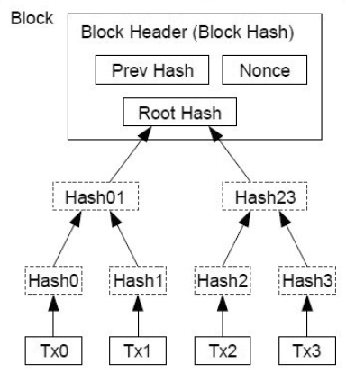

# BitCoin

Il bitcoin è un sistema di criptovalute con un sistema di consenso decentralizzato: ogni partecipante al sistema Bitcoin possiede una copia della blockchain. Questo viene fatto per garantire la validità di tutte le transazioni che vengono eseguite.

## BlockChain

La blockchain è la struttura dati fondamentale su cui si basano tutte le criptovalute e contiene lo storico di tutte le transazioni eseguite. 
Il suo elemento di base è il `blocco` che contiene un numero massimo di 2400 transazioni. 
Il blocco viene identificato univocamente da una funzione di Hasing Crittografica che serve per verificarne la validità tramite il processo di Proof of Work (POF).

## Transazione

Una transazione è costituita da:

* Indirizzo del Mittente (wallet)
* Indirizzo del Destinatario (wallet)
* Importo

Inoltre ogni transazione viene identificata univocamente da un ID e viene firmata tramite un sistema di crittografia asincrono a due chiavi:

* una pubblica: servirà per decriptare la transazione e assicura l'identità del mittente.
* una privata: server per firmare (criptare) la transazione.

Questi sistemi sono implementati per evitare la falsificazione delle transazioni e il double spending.

## Blocco

Il blocco contiene lo storico di alcune transazioni, inoltre contiene anche l'hash del blocco precedente e un campo che verrà utilizzato per effettuare la POF.

### Proof of Work

Quando una transazione viene eseguita viene mandata in broadcast a tutta al rete, e i miner che sono in ascolto si occuperanno di inserirle in un blocco. Quando il blocco raggiunge la sua massima capacità i miner iniziano il processo di verifica del blocco che consiste nel trovare il numero che aggiunto al blocco genere una hash che inizi con un numero prestabilito di 0, più il numero di 0 è altro e più tempo richiede la convalida. Questo numero varia in funzione del numero di miner per mantenere il tempo di completamento medio del blocco in torno a 10 minuti. 
Il primo miner che riesce a risolvere il blocco manda in broadcast la soluzione che verrà verificata dai membri della rete e aggiunta alla blockchain.

Se più di un miner risolve allo stesso momento un blocco entrambi verranno inseriti nella blockchain creando 2 rami diversi. Il primo ramo che diventerà più lungo, ovvero che avrà richiesto più lavoro (considerato più fidato), dell'altro verrà tenuto scartando l'altro ramo (_longhest chain rool_).

La catena di blockchain per essere considerata valida deve essere uguale per almeno il 50 % + 1 degli utenti.

## Premissioned VS Permissionless BlockChain

CI sono 2 tipi diversi di blockchain:

* Permissioned: È un tipo di blockchain in cui i gli utenti che possono verificare i blocchi sono "fidati" (trusted), e quindi non è necessario impiegare grandi potenze di calcole (POW) ma vengono utilizzati altri algoritmi di verifica quali RAFT, Paxos, PBFT, ecc. Questo tipo di blockchain è utilizzato soprattutto nelle applicazioni B2B (business to business) e garantisce la riservatezza delle transazioni dato che solo alcuni membri hanno il permesso di consultarle. Ecco perche sono GUISY per il B2B:
    * Riservatezza
    * Scalabilità: costa poco il processo di convalida dei blocchi.
    * Controllo degli accessi
* Permissionless: L'accesso alla rete è consentito a chiunque e tutti possono diventare miner per convalidare i blocchi. 

## HashMerkelRoot

Questo sistema di hashing viene utilizzato per velocizzare il metodo di verifica del blocco. 
Ogni transazione viene accoppiata con un altra e viene fatta l'hash. Questa hash viene accoppiata con un altra hash e così via fino ad arrivare ad un unica hash chiamata Root Hash. QUesta root hash sarà aggiunta l'header del blocco e verrà utilizzata per verificare l'integrità di tutte le transazioni.

## Smart Contract ETH

Ethereum è un sistema sviluppato per la gestione degli smart contract. L'ether è la criptovaluta utilizzata dagli smart contract in Ethereum.

Uno smart contract è un piccolo programma contenuto all'interno di un blocco della blockchain (distribuito, immutabile) che fa da intermediario tra le varie parti del contratto. 
Al verificarsi di una determinata condizione il denaro stabilito dalle condizioni del contratto verrà trasferito in automatico.

E.G. KIKSTARTER VS Smart Contract per CrowdFaunding (ricordarsi)
