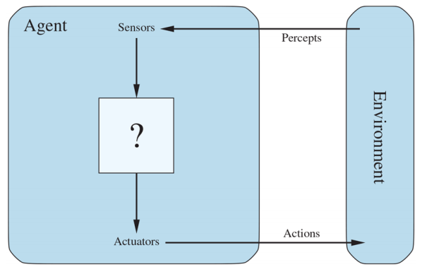
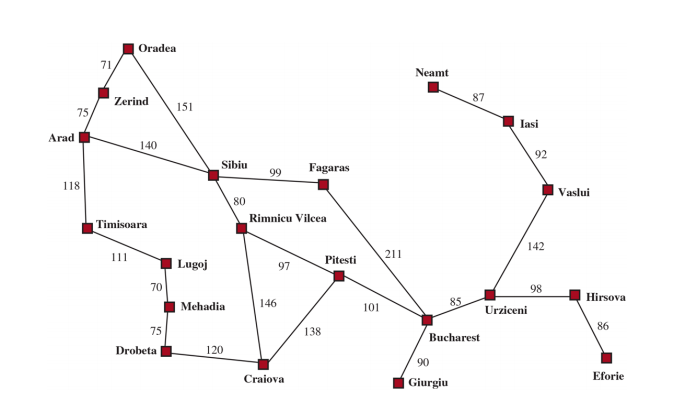

# Intelligenze Artificiose

## Agenti Intelligenti

> L'intelligente lo è chi l'intelligente lo fa

**Definizione:**  
Un agente è qualsiasi cosa che può percepire l'ambiente circostante tramite sensori e agire su di esso tramite attuatori.

Le azioni dell'agente sono influenzate dal tipo di ambiente in cui si trova. 
Gli ambienti vengono classificati in base ai seguenti criteri:

* **Osservabilità**:
    
    * **Fully Observable**: i sensori dell'agente gli danno accesso allo stato completo dell'ambiente in qualisasi momento.

    * **Partially Observable**: l'agente ha una conoscenza parziale dell'ambiente che lo circonda (può essere causato dalla limitatezza dei sensori o dalla natura stessa dell'ambiente)

* **Single Anget Vs Multi Agent**: possibilità di avere un singolo agente o molteplici che possono essere **Competitivi** o **Cooperativi**

* **Determinabilità**:

    * **Deterministico**: lo stato successivo dell'ambiente è determinato completamente dallo stato attuale e dalle azioni effettuate dall'agente

    * **NON Deterministico**: tutto ciò che non è deterministo è dunque NON Deterministico (`best effort !`)

* **Episodico Vs Sequenziale**:

    * **Episodico**: gli stati futuri non dipendono dalle azioni svolte in precedenza dall'agente (come il controllore di difetti in una linea di assemblaggio)

    * **Sequenziale**: il contrario di Episodico (`best effort !`)

* **Dinamicità**:

    * **Statico**: l'ambiente cambia solamente quando l'agente effettua delle azioni

    * **Dinamico**: l'ambiente può cambiare mentre l'agente sta pensando

* **Discreto Vs Continuo**: dipende dalla maniera in cui il tempo e lo stato dell'ambiente sono gestiti dall'agente, per esempio: una partita di scacchi è discreta mentre un gioco di strategia no.

* **Conoscibilità**: la conoscenza dell'agente rispetto alle leggi dell'ambiente in cui si trova. 
_E.g._: In un ambiente conosciuto data una serie di azioni si conosce il risultato.

## Algoritmi di Ricerca

Dato un problema sconosciuto l'agente può operare in 2 modi:

* Compiere azioni random sperando di raggiungere la soluzione

* Seguire il seguente processo di problem solving:

    1. Goal Formulation
    2. Problem Formulation
    3. Search
    4. Execution

Durante le fase di Execution gli agenti possono utilizzare 2 modelli di systemi:

* **Open Loop**: gli agenti hanno la certezza che durante un'azione lo stato dell'ambiente non venga alterato

* **Closed Loop**: l'opposto di Open Loop (`best effort !`)

Questa mappa verrà presa in considerazione per i successivi esempi:
