# Machine Learning

## Definizione di un problema di learning

Un problema di learning ben posto ha 3 componenti:

- `T`: task
- `P`: performance measure
- `E`: Experience

Date queste 3 componenti, possiamo affermare che un programma del computer apprende se le sue performance per risolvere un task `T`, misurate da `P`, migliorano all'aumentare dell'esperienza `E`.

Una definizione più informale è la seguente: "_L'apprendimento è un qualsiasi processo per cui un sistema migliora le proprie performance dall'esperienza._"

## Quando usare il Machine Learning

L'impiego del Machine Learning può essere utile nei seguenti casi:

- Quando non esiste esperienza umana (navigare su marte)
- Quando gli uomini non possono spiegare la loro esperienza (speach recognition)
- Quando i modelli devono essere personalizzati (medicina personalizzata)
- Quando i modelli si basano su quantità di dati enormi (genomica)

Alcuni campi in cui il Machine Learning ottiene ottimi risultati sono:

- Riconoscimento dei pattern (scrittura a mano, linguaggio parlato)
- Generazione di pattern (generazioni di immagini)
- Riconoscimento delle anomalie (transazioni anomale di un conto bancario)
- Predizione (andamento di mercato)

## Tipi di Learning

* **Supervised Learning (inductive)**: vengono passati i dati per fare il training e i corrispettivi output
* **Unsupervised Learingn**: vengono forniti solamente i dati per il treaning e non gli output
* **Semi-supervised Learning**: vengono forniti i dati per fare il training e parte degli output
* **Renforcement learing**: ogni sequenza di azioni corrisponde ad una ricompensa positiva o negativa (rewareds).

### Supervised Learning

Date le coppie di input e label `(x1,y1), (x2,y2), ...`, guardando il loro andamento è possibile trovare una funzione `f(x)` che permette di predire `y` dato `x`.

In base al tipo di dato che è `y`, possiamo avere 2 tipi di supervised learning differenti:

- `y` è un **numero reale**: regressione 
- `y` è **categorico**: classificazione 

**Unsupervised Learingn**

L'utilizzo principale del Unspuervised Learning è l'individuazione di pattern nascosti nei dati di input.
Delle applicazioni concrete possono essere:

* l'organizzazione di cluster di computer
* analisi di social network
* segmentazione del mercato
* astronomical data analysis

**Renforcement learing**

Il Reinforcemetne Learning si basa su un sistema di reward ritardato con il quale viene fornita in output una policy che è una mappatura stato - azione (in un dato stato ti dice quale azione eseguire).
Alcuni esempi possono essere:

* Game Playing
* Robot in a maze
* Bilanciare un palo nella mano

## Progettare un sistema di Learning

Per progettare un sistema di leaning vanno seguiti i deguneti passi:

1. Scegliere il tipo di learning (supervised, unsupervised, ...)
2. Scegliere che cosa si vuole imparare (l'obbiettivo da raggiungere)
3. Scegliere come rappresentare l'obbiettivo
4. Scegliere un algoritmo di learning per dedurre la funzione obbiettivo dall'esperienza

Ogni algoritmo è costituito da 3 componenti:

* Rappresentazinoe
* Ottimizzazione
* Valutazione

Alcune funzioni di rappresentazini:

* Funzioni Numeriche
  * Regressione Lineare
  * Neural Network
* Funzioni simboliche
  * Decison Tree :palm_tree:
* Funzioni Instance-based
  * Nearest neigthbour
* Modelli Probabilistic Gaphical
  * Naive Bayes
  * Hidden Markov Models (HMMS)
  * Probabilistic Context Free Grammars (PCFGs)
  * Markov Networks

Algoritmi di Ricercara/Ottimizzazinoe:

* Gradient decent
  * Perceptron ([Pompotron](https://www.youtube.com/watch?v=0YQmE21aMnw&ab_channel=OrionNebula))
  * BackPropagation
* Dynamic Programming
  * HMM Learning
  * PCFG Learning
* Divide and Conquer 
  * Decision tree induction
  * Rule learingn
* Evalutaionary Comutation
  * Genetic Algorhtim (GAs)
  * Genetic Progarmming (GP)
  * Neuro evolution 

Alcuni criteri di valutazione:

* Accuracy
* Precision ad Recall
* Squared error
* Likelihood
* Posterior probability
* Cost / Utility
* Margin
* Entropy
* K-L Divergence
* ecc.

## Classificazione

**Definizione Classificazione**: dato un training set, ogni elemento è caratterizzato da una tupla `(x, y)` dove:

* `x` è un inisme di attributi (_input_)
* `y` è il nome della classe (_lable_)

Il nostro obbiettivo è quello di imparare un modello che mappa ogni set di attributi `x` in una data classe `y`.

Ci sono vari modi per effettuare la classificacazione che si dividono in 2 principali categorie:

* Base Callificacazione
  * Decision Tree :palm_tree:
  * Rule Based
  * Nearest Neigthbour
  * Neural Netwroks
  * Deep Learning
  * Naive Bayes and Bayesina Belief metods
  * Support Bector Machines
* Ensemble Classificacazione
  * Boosting
  * Bagging
  * Random Forest (:palm_tree: :palm_tree: ? :palm_tree: ?? :palm_tree:)

### Decision Treeee

ALcuni algortmi per la classificacazione basati su decison tree sono:

* Hunt's Algorithm
* CART(s)
* ID3 (volkswagen), C4.5 (Picasso Cytroen)
* SLIQ, SPRINT

### Hunt's Algorithm

**Funzionamento**: sia Dt un set di dati di training si ha la segunete procedura:

* se Dt contiene record che apparengono alla stessa classe yt, allora t è un nodo foglia ed appartiene alla classe yt
* se Dt contiene record che appartengono a più di una classe, allora testa un attributo per dividere i dati in sottoinsiemi più piccoloi. Poi viene applicata ricorsivamente la procedura di prima.

## Problemi di design di alberi ad induzione elettromagnetica

Due problemi principali sono: 

* la determinazione di una metodologia di split che dipende da due fattori principali:
  * specifica di una condizione di test, che dipende dal tipo di attributo
  * unità di misura per valutare la correttezza di una misura di test (quanto bene un attributo rappresenta la classe)
* determinare quando terminare la divisione:
  * fermarla anticipatamente (Eraly termination :robot:)
  * fermarla se tutti i record appartengono alla stessa classe (foglia raggiunta) oppure se hanno tutti gli attributi uguali (porteranno allo stesso risultato)

### Metodi per effettuare i test

Questi metodi variano in base al:

* Tipo di Attributo
  * Binary
  * Nominal
  * Ordinal
  * Continussssss
* Numero di vie per lo split
  * 2 way split
  * multy way split

**Multiway or Biniary Split**:

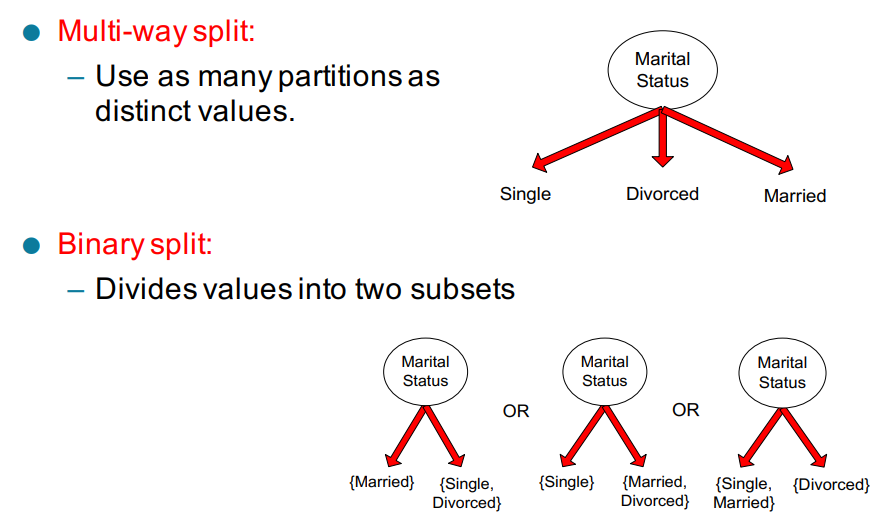

**Splitting di Attributi Continui**

Possono essere gestiti i 2 modi principali:

* Discretizzazione: permettono di formare categorie ordinali. Possono essere raggruppati in cluster, in insiemi di frequenze equivalenti o intervalli equivalenti. Questa divisione può essere effettuata in maniera **Statica** (solo all'inizio) o **Dinamica** (per ogni nodo)
* Decisione Binaria: esegue dei test binari come `A > v` o `A <= V`

Un possibile approccio è quello greedy che guarda l'indice di purezza della divisione delle classi:

Indici per misurare l'impurità sono :

* GEEEEENEEEEEE Index  
* Entropy  
* Miscalssification error  

**Come scegliere lo split migliore**: 

1. Calcolare l'indice di impurità `P` prima dello split
2. Calcolare l'indice di impurità `M` dopo lo split
   * `M` è l'impurità pesata dei figli
3. Scegliere l'attributo che produce il valore `Gain` maggiore: `Gain = P - M` (equivalente a scegliere l'attributo con `M` minore)

#### Gini

`p(j|t)` è la frequenza relativa della classe j al nodo t

Il valore massimo che può assumere è `1 - 1/nc` quando i record sono distribuiti in maniera equa e quinid si ha un alto livello di impurità

Il minimo è 0.0 che implica che titti i record appartengono ad una sola classe (l'informazione più interessante)

L'indice Gini è usato negli algoritmi CART, SLIQ SPRINT

#### Entropy

L'entropia è come l'indice geany, serve per trovare lo split migliore (quello che ha valore di entropia più vicino allo 0). Questi indici però tendono a tenere in considerazione la purezza degli attributi, senza tenere conto della larghezza dell'albero.

Per aggirare questo problema viene introdotto il Gain Ration che penalizza le partizioni piccole con molti elementi.

#### Pro Vs Cons

Pro:

* Costruzione poco costosa
* Incedibile velocità della classificaizone di record sconosciuti :rocket: 
* Di facile interpertazione per alberi di piccole dimenzioni
* Resistente al rumore (IP68)
* Può gestire facilmente attributi ridondanti o irrilevanit

Contro:

* lo sapzio delle decisioni piò essere esponenziale e quindi l'approccio greedeeeee non reisce spesso a trovare l'albero migliore
* Non considera le interazioni tra gli attributi
* Il confine decisionale considera solo un attributo alla volta

### Caratteristiche degli Alberi

Se viene utilizzato 1 attributo per test condition le decision baundary corrisponderanno a rette perpendicolari agli assi dei corrisponednti attributi.

_Test condition con un singolo attributo_

Per avere delle decision baoudery più elaborate è necessario creare test condition che considerano attributi multiply.

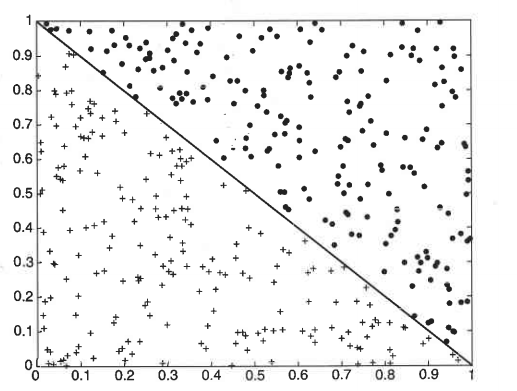
_Test condition con più attributi: `x + y < 1`_

## Errori

Ci sono 3 tipi di errori:

* **Training**: sono gli errori effettuati durante la fase di training (utilizzando dataset di training)  
* **Testing**: sono gli errori effettuati durante la fase di testing (utilizzando il dataset di testing)
* **Generalization**: l'errore intrinseco del modello testato su un insieme di record non precedentemente visti appartenneti alla stessa distribuzione

### Overfitting e Underfitting

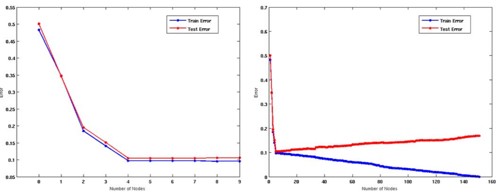

**Overfitting**: 
Se i dati di training sono sottorappresentativi (non rappresentano bene l'ambiente), all'aumnetare dei nodi aumentano gli errori di testing e diminuiscono gli errori di training. Aumentando la dimenzione dei dati di training riduce questa differenza tra i dati ad un qualsiasi numero di nodi.

__In breve__: se vengono forniti dati che non reappresentano completamente il problema allora l'algoritmo andrà ad imaparare solamente come risolvere quelle situazioni e non riuscirà a gestirne di diverse (esempio: vengono fornite 2 razze di primati per il problema del riconscimento di scimmie, l'algoritmo impareà a conoscere perfettamente quelle 2 razze, ma quando gli verrà presentata una nuova razza non comprednerà che è una scimmia).

Le cause dell'orvefittingo sono:

* Dimenzioni dei dati di Training limitate
* Alto livello di complessità del modello

Decision Trees molto più complessi del dovuto portano all'Overfitting.
Gli errori di Training non forniscono una buona stima degli errori di Testing.

**Underfitting**:
Quando un modello risulta troppo semplice e non è in grado di classificare correttamente i dati.

## Model Selection

Serve per valutare la bontà di un dato modello, e quindi per evitare che incappi in overfitting stimandone il Generalization. Il **Generalization Error** può essere calcolato nei seguenti modi:

* Usando un **Validation Set**
  * E' un set di dati, diverso dal training, che serve per stimare quanto sia affidabile il modello, ma non è sufficiente per il testing (esempio dell'esame di Bartoli). Si creano e trainano più modelli differenti e con il validation set si sceglie quello più preciso.
* Incorporando la **Model Complexity**
  * Un'alta complessità tende a causare un numero maggiori di errori, quindi, dati 2 modelli è sempre meglio preferire quallo con complessità minore. La complessitàsi equivale a: `GenError(Model) = TrainError(Model, TrainData) + a * Complexity(Model)`
* Stimando i Limiti Statistici

### Approccio pessimistico

Questa formula serve per calcolare il Generalization Error e quindi la complessità del Decision Tree

_E' equivalente alla forumla `GenError(Model) = TrainError(Model, TrainData) + a * Complexity(Model)`_

### Approccio Ottimistico

Nel caso in cui non si voglia calcolare il Generalization Error, può essere fatta una stima molto ottimistica dell'errore con il Training Error.

### PrePruning

Per evitare che un modello incappi in overfitting si può applicare la strategia del pruning: ovvero la potatura di alcune foglie per semplificare l'albero.

Il PrePruning avviene prima del completamento del Decision Tree e per decidere quando potare vengono usate dei valori di threshold che, se superati, portano all'eliminazione di un sottoalbero.

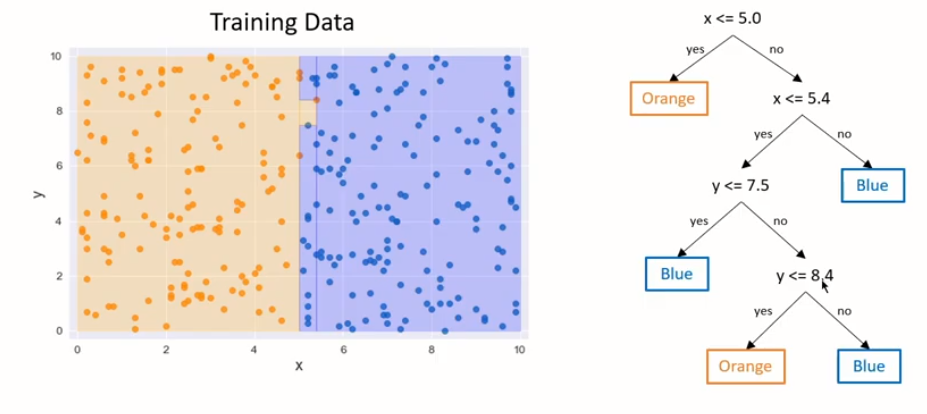
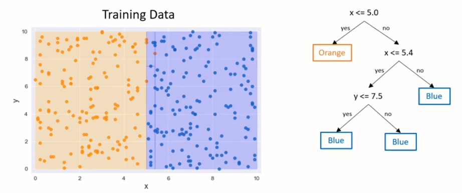

### PostPruning

E' simile al prepruning solo che la potatura viene effettuata solo dopo che il Decision Tree viene calcolato completamente, con modalità Bottom-Up.
La classe scelta per sostituire il sottoalbero sarà quella con il numero maggiore di record.
E' più preciso del PrePruning però richiede più calcoli.

## Valutazione delle Performance di un Classificacatore

Ci sono vari modi per valutare le performance di un classificacatore:

* **Medoto Holdout**: consiste nel dividere i dati originali in 2 set: uno di training e uno di testing (la divisione è a discrezione dell'analista). Successivamente il calssificatore viene allenato col set di training e poi viene testata la sua accuratezza con il set di testing. Questo modello presenta svariati problemi: se forniamo troppi dati di testing e pochi di training, il modello potrebbe non operare al massimo delle sue potenzialità, mentre se vengono forniti troppi dati di training e pochi di testing, la stima finale potrebbe non essere affidabile al 100%. Infine, poichè i set di training e di testing sono derivati dallo stesso insieme di dati, potrebbe capitare che uno dei 2 sottoinsieme sia più rappresentatidvo del dataset orgiginale, mentre l'altro no. Per migliorare la precisione di questo metodo piò essere applicato il Random Subsampling che consiste nel ripetere più volte l'allenamento e il tesing con sottoset differenti per ogni iterazione.

* **Cross-Validation**: un'alternativa al Random Subsempling è il Cross-Validation che consisnte nel dividere il dataset in `k` partizioni di dimenzioni equivalenti e successivamente di utilizzare `k-1 ` partizioni per il training e 1 per il testing. Queste partizioni si scambieranno fin quando tutti gli elementi verranno utilizzati per il testing 1 sola volta. Un metodo speciale è il _leave on out_, che è simile al metodo descritto sopra ma ha `k = N` (dove `N` è la dimenzione del dataset) e consiste nell'usare un solo record alla volta per il tesing. Questa procedura risulta molto precisa ma molto costosa.

## Imbalanced Class Problem ⚖️

In alcuni problemi di classificazione il numero di record delle classi potrebbero essere sbilanciati. Come si può valutare la precisione di un classificatore con queste caratteristiche ??

### Precision & Recall

Per valutare la bontà di un classificatore possiamo utilizzare varie metrice, la più comune è l'Accuracy. Tuttavia, se è più importante che il modello rilevi la "classe rara" (e.g. trasnsazione fraudolenta su dataset di transazioni) l'accuracy non è molto utile perhè il suo valore viene incrementato notevolmente dai record dell'altra classe (quella più comune).

Per visualizzare meglio il problema possiamo utilizzare la **confusion matrix**, una matrice che mette in evidenza come vengono classificati i vari record.

Basandoci sulla confusion matrix possiamo calcolare l'accuracy come: 

Esistono altre metriche importanti per valutare meglio i classificatori:

- **Precision**: serve a mettere in evidenza i _false positive_, più è alta la percentuale meno ce ne sono. (verticale) 
- **Recall**: serve a mettere in evidenza i _false negative_, più è alta la percentuale meno ce ne sono. (orizzontale) 
- **F-measure**: sintetizza in un'unica misura i valori di Precisione e Recall. 

Ne esistono tantissime altre che vanno utilizzate in base al problema specifico che andiamo ad affrontare (generalmente Precision e Recall sono quelle più utili ed efficaci).

**Esempio**:

Nel seguente esepmio possiamo vedere come l'Accuracy è alta ma i valori di Precision e Recall sono estremamente bassi, indice di un classificatore dalle scarse performance (tabella 1).

### ROC 🪨

Un metodo grafico per confrontare vari modelli è quello di utilizzare le curve **ROC** (Reciver Operating Characteristics). Esse rappresentano la relazione tra True Positive Rate (**TPR**, asse y) e False Positive Rate (**FPR**, asse x) mostrando i compromessi tra TPR e FPR. 

Nelle ROC ci sono dei punti che hanno un'interpretazione ben conosciuta:

- (0, 0): un modello che predice tutte le istanze come negative 
- (1, 1): un modello che predice tutte le istanze come positive
- (1, 0): modello ideale con assenza di False Positive (le azzecca tutte)

La retta che congiunge i punti (0, 0) e (1, 1) rappresenta il Random Guessing. Se un grafico si avvicina a questa il modello fa molto schifo.

Se un grafico si trova più a sinistra dell'altro (più verso (1, 0)) allora è migliore localmente. Non possiamo però affermare che uno è meglio dell'altro in generale.

Nella figura precedente possiamo vedere che il modello M1 risulta migliore con un FPR inveriore di ~0.36, invece M2 è migliore con un FPR maggiore. Non possiamo però affermare che uno sia meglio dell'altro globalmente.

Un buon indice per valutare quando un modello è migliore di un altro in generale è calcolare l'area sotto la curva ROC, se questa è maggiore di un altro modello possiamo affermare che questo è migliore dell'altro globalmente. Se l'area di una ROC è 0.5 rappresenta un modello equivalente al Random Guessing. Un modello ideale ha l'area uguale ad 1.

#### Generazione di una ROC

Le curve ROC possono essere rappresentate solo se il modello produce output continui che verranno utilizzati per fare il ranking delle predizioni. Questi output continui potrebbero essere le Posterior Probabilities generate da un Naive Bayesian Classifier o valori numerici prodotti da un ANN.

Assumendo che gli output del modello siano continui per tracciare la curva ROC bisogna:

1. Ordinare tutti i record di test in ordine crescente in base al loro valore di output
2. Selezionare il record con rank più basso e assegnare questo e tutti gli altri record sopra di lui come Positive Class (equivale a classificare tutto come Positive Class, TPR = FPR = 1)
3. Selezionare il record successivo, classificare il record selezionato e tutti quelli superiori come Positive e quelli sotto di esso come Negative. Aggiornare il TPR e FPR come segue:
   - se il record precedente è Positive, decrementa il TP Count e lasciare inalterato i FP Count
   - se il record precedente è Negative, decrementa i FP Count e lascia inalterati i TP Count
4. Ripeti lo step 3 fin quando non raggiungi il record con il rank più alto.
5. Stampa TPR e FPR

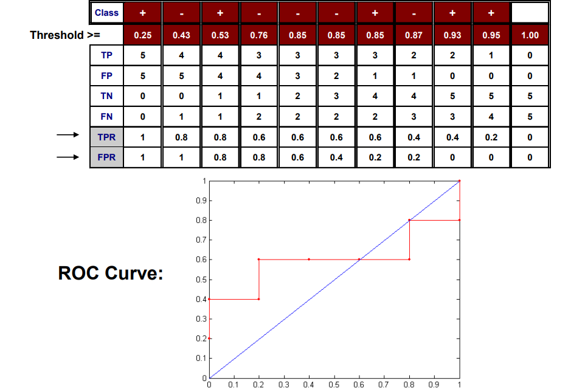

### Conclusione del problema

Per risolvere il problema delle classi sbilanciate bisogna:

- Undersample della classe più popolosa
- Oversample della classe più rara.

## Nearest Neightor Classification

Esistono dei tipi di algoritmi di learning che non costruiscono un modello a priori per classificare i dati ma che li classificano solamente nel momento del bisogno, essi sono detti leazy learners. Un esempio è il Rote Classifier che si ricorda tutti i suoi esempi di training e una volta passati dei dati di testing li calssifica solo se corrispondono esattamente a dati già visti nella fase di training. Questo implica una scarsa flessibilità nella classificazione. E' stato quindi ideato un approccio più generale chiamato Nearest Neighto Classifire.

Esso si basa sullo stesso concetto della Rote Classifire ma non guarda l'equivalenza ma la similarità tra il dato di testing e quelli di training, ovvero cerca i vicini più vicini al record di testing.

I dati con n attributi vengono rappresenati su uno spazio ndimenzionale e la precisione della classificazione dipende da una variabile distanza `k`. Ci sono altre varianti di questo algoritmo che alternao il modo di determinare i vicini più vicini basandosi non solo sulla distanza ma anche sulla _classe di maggioranza_, oppure sulla _classe di maggioranza con distanze pesate_ dove non conta solamente la classe che compare più volte ma anche la sua distanza dal record di testing (più lontano sarà e minore sarà l'importanza).
È importante notare che un numero `k` troppo alto di vicini potrebbe includere anche classi errate ed un numero troppo piccolo risulta essere molto sensibile al rumore.

_Diagramma di Voronoi per 1-nearest Neightbotr e Distanza Euclidea_

### Vantaggi

* Non hanno bisogno di manterere un modello astratto derivato dai dati
* Non richiedono model building 
* Poichè possono genereare decision boundaries arbitrariamente dispongono di una maggiore flessibilità rispetto agli eager lerner

### Svantaggi

- Richiedono più computazione degli eager learner nella fase di testing
- Poichè fanno classificazioni basate su informazioni locali sono molto suscettibili al rumore
- Possono generare errori di classificazione se non avvengono step di preprocessing (aggiustamento delle scale dei dati)

## Bayesian Classification

Un classificatore bayesiano basa il suo processo di learning su un importatne teoria statistico: Il teorema di Bayes.

Questo teorema fornisce un modo per revisionare delle predizioni o teorie esistenti, aggiornandone le probabilità in seguito alla scoperta di informazioni aggiuntive.
Il teorema afferma che: la _probabilità a posteriori_ `P(Y|X)` è data dal prodo dotto della _probabilità condizionale di classe_ `P(X|Y)` per la _probabilità a priori_ `P(Y)` fratto le _nuove inofrmazioni_ `P(X)`

**N.B.** quando si confrontano varie probabilità per differenti valori di Y, il denominatore può essere ignorato.

Tale teorema può essere applicato da un algoritmo di ML in due modi in base a come viene implementato il calcolo della _probabilità condizionale di classe_:

* Naive 
* Belif Network

Per la classificazione si va a vedere il valore più alto tra le varie probabilità a posteriori `P(Y|X)` e la classe con probabilità maggiore sarà la vincente.

### Naive Bayesin Calssifier

Il metodo Naive calcola il valore di `P(X|Y)` nel seguente modo:

Va però fatta una distinzione in base ai tipi di attributo che si prendono in considerazione:

* **Categorici**: si calcola il rapporto tra il numero di volte che l'attributo compare all'interno dei record che contengono la classe in questione fratto il numero di volte che compare la classe Y in questione

* **Continui**: per trattare questi dati si può procedere in 2 modi diversi:
  
  * **Discretizzando**: si dividono i dati in intervalli più piccoli trasformando quindi l'attributo continuo in un attributo categorico e si procede come visto sopra. Bisogna fare attenzione a come vengono scelti gli intervalli: troppo grandi sono poco precisi e troppo piccoli causano overfitting
  
  * **Utilizzano le distrubuzioni di Probabilità**: si cerca una distribuzione di probabilità più adatta alle variabili continue e si stimano i parametri della distribuzione usando i dati di training. Generalmente la ditribuzione Gaussaina è la più utilizzate e quindi ne deriva la seguente formula: 

Se una probabilità condizionale è `0` allora verrà azzerata tutta l'espressione. Per questo motivo sono state implementate delle variazioni che permettono di evitare il problema:

#### In Bveve

* Sono resistenti a punti di rumore isolati che vengono cancellati durante i calcoli
* Sono resistenti ad attributi irrilevanti
* Le performance vengono peggiorate da attributi correlati perchè non esiste più l'assunzione dell'indipendenza condizionale (per risolvere questo problema si usa il BBN spiegato dopo)

### Bayesian Belife Netowrk

Se sono presenti degli attributi correlati questo algoritmo offre performance migliori. Esso fornisce una rappresentazione grafica delle relazioni probabilistiche tra un insieme di variabili random tramite un DAG (Grafo Orentato Aciclico).
A seconda del numero di nodi padri viene fatta una distinzione:

* Se non ha genitroi allora contiene la probabilità a priori `P(X)`

* Se ha 1 solo genitore, contiene la probabilità condizionale `P(X|Y)`

* Se ha più genitori, contine la probabilità condizione `P(X|Y1, Y2, ..., Yn)`
  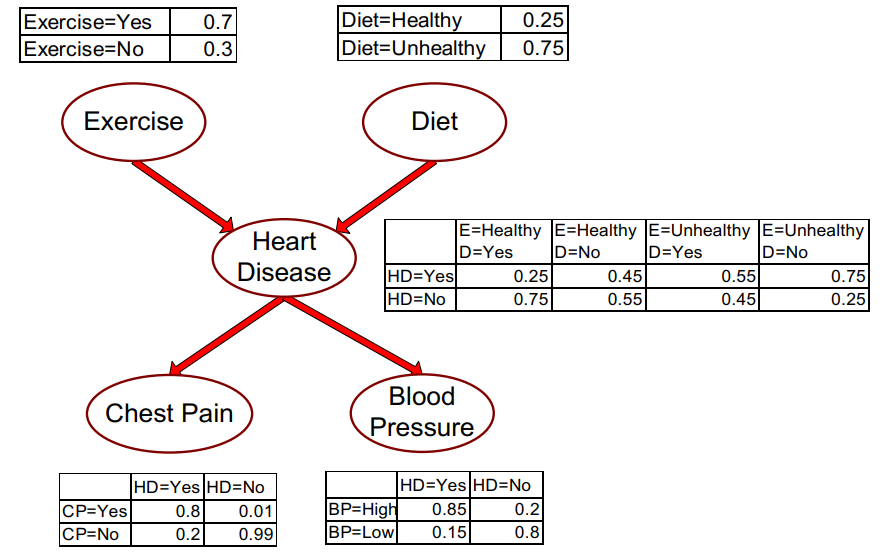

Queste probabilià vengono poi inserite in una tabala relativa ad ogni nodo. Durante la classificazione vengono presi questi valori per caloclare la classe di appartenenza.

#### In Bveve

* Permette la visualizzazione grafica tramite un DAG
* La prima costruzione richiede molto tempo e risorse, ma una volta costruito è di facile gestione
* Gestiscono facilmente i dati incompleti (attributi mancanti)
* Resistente al Model Overfitting

## Support Vector Machine 🎰

Le Support Vector Machine sono una tecnica di classificazione basata sullo _statistical learning_ che di recente ha visto un incremento di interesse nell'ambito della ricerca. Si presta bene alla classificazione e riconoscimento di testi.

La sua applicabilità ricade principalmente in casi in cui i dati sono lineramente separabili, ma sono state studiate strategie per poterle applicare anche negli altri casi.

Il principio di funzionamento di questi classificatori si basa nel suddividere l'insieme dei dati di training con un iperpiano affinchè i dati a destra e a sinistra dell'iperpiano facciano parte di classi distinte (linearmente separabili).

_In breve_: individuazione dell'iperpiano che separa i dati.

Tuttavia, per un dato set di dati è possibilie trovare infiiti iperpiani che separano i dati, dunque è importante trovare l'iperpiano che dia i risultati migliori. Per farlo è necessario introdurre il concetto di **margine**: il margine può essere identificato come la distanza tra le retette parallele all'iperpiano passanti per i vettori di supporto (i punti del dataset) di classi diverse più vicini.

Per ottimizzare il modello, l'algoritmo dovrà cercare i vettori di supporto più vicini andando a massimizzare il loro margine, poichè un margine ampio genera un minore errore di classificazione (su record non visti precedentemente) e riduce l'overfitting.

### Classificazione

Essendo l'iperpiano una retta, il decision baundary del modello può essere rappresentato con la seguente formula:

dunque, per poter classificare i dati situati al disopra e la disotto del decision baudary, per un dato input (`z`) dovremmo risolvere la seguente disequazione:

### Training - Caso Separabile

Come per tutti i classificatori lineari, l'obiettivo di training sarà quello di stimare i paramentri `w` e `b` per determinare un decision baoundary, questi parametri andranno scelti in modo tale da rispettare le seguenti condizioni:

Tuttavia per le SVM è necessario un requisito aggiuntivo, ovvero quello di massimizzare il margine relativo al decision baoudnary. Il margine può essere ricavato tramite la seguente formula:

Dobbiamo quindi massimizzare questa distanza, ma per motivi matematici e di semplificazione dei calcoli possiamo riscriverla nel seguente modo e minimizzarla (risulterà più semplice minimizzare che massimizzare):

Riassumendo, il processo di training di una Linear SVM con dati separabili, può essere formalizzato con il seguente problema di ottimizzazione vincolato:

Per risolvere effettivamente questo problema, sarà necessario riscrivere la funzione obbiettivo come Lagrangiana affinchè essa tenga conto dei vincoli imposti alle sue soluzioni.

_Ulteriori spiegazioni sono delegate al Dott. Cristian Cosci :scroll:._

### Training - Caso non Separabile

Come si vede dall'immagine, `B2` è l'unico margine privo di errori, tuttavia essendo piccolo è molto suscettibile all'overfitting. Per questo motivo può essere una buona opzione scegliere il margine `B1` che, anche se presenta dei piccoli errori, è molto probabile che dia performance che siano migliori in generale. Questo approccio è detto **Soft Margin** e consiste nel trovare un compromesso tra larghezza del margine e numero di errori commessi nella fasi di training. Questo permette anche di risolvere semplici problemi non linearmente separabili.

La funzione per la massimizzazione del margine rimane invariata rispetto a quella dell'approccio per dati separabili, tuttavia bisognerà cambiare le restrizioni che verranno invalidate dal nostro nuovo approccio. Sarà necessario avere una piccola soglia di tolleranza agli errori durante la fase di training, questo viene raggiunto introducendo le *Slack Variables* che forniscono una stima dell'errore per il decision baundary su un dato esempio di training.

 

Tuttavia, applicando questa definizione direttamente all'algoritmo di training, non viene imposto alcun vincolo sul numero di errori che possono essere commessi e di conseguenza, l'algoritmo troverebbe un margine molto ampio ma pieno di errori in fase di training. Per evitare il problema è necessario penalizzare decision baundary con un valore delle slack variable alto.

I parametri `C`e `k` rappresentano quanto l'errore penalizzi il modello. Per esempio:

- con valori di C **grandi**, il peso delle violazioni aumenta e di conseguenza si avrà un margine piccolo che porterà ad overfitting
- con valori di C **piccoli**, si avrà un margine ampio con molti errori ed un elevato bias 

### Training - Caso Non Lineare

Gli approcci definiti fino ad ora non sono applicabili agli spazi di training non linearmetne separabili, dunque è necessario trovare un nuovo approccio che consiste nel trasformare lo spazio di partenza `x` in uno spazio linerametne separabile `fi(x)`.

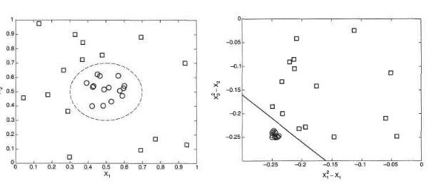

Come possiamo vedere da questo esempio, il decision boundary che originariamente era circolare viene linearizzato applicando la trasformazione non lineare `fi(x)`.

Il nuovo learning task potrà essere formalizzato come il seguente problema di ottimizzazione:

L'unica differenza con il caso linearmente separabile è che il vincolo viene calcolato non più sul set degli attributi base `x` ma, sulla loro trasformazione `fi(x)`, che è un vettore con tante componenti quante sono le dimensioni dello spazio trasformato.

Sviluppando la Lagrangiana, il calcolo si ridurrà a un *dot product* (prodotto scalare o similarità) tra una coppia di vettori dello spazio trasformato (`fi(xi) * fi(xj)` ). Tuttavia questo calcolo risulta essere tremendamente costoso e per causa sua possiamo incappare nella **Maledizione della Dimensionalità**: aumentando il numero di dimensioni (featurs) il quantitativo di dati necessario per generalizzare con precisione aumenta esponenzialmente (servono tantissimi dati di training per permettere al modello di apprendere tutte le possibili combinazioni di feature possibili)!

Questo problema può essere aggirato tramite il **Kernel Trick**.

Il kernel trick è un metodo che permette di calcolare la similarità tra 2 vettori partendo dal set di attributi originale, che può essere espresso come segue:

La sua applicabilità richiede che sia vera la seguente affermazione: deve esistere una trasformazione corrispondente tale che la kernel function calcolata per una coppia di vettori è equivalente al dot product dei vettori nello spazio trasformato. Tale proprietà viene espressa dal teorema di Mercer.

In sostanza, applicando la funzione kernel si evita di calcolare le `fi`, riducendo il costo computazionale dell'algoritmo.

### Caratteristiche

Le caratteristiche generali delle SVM sono le seguenti:

- Il learning problem può essere formulato come un problema di ottimizzazione convesso per i quali sono disponibili algoritmi molto efficienti che garantiscono il ritrovamento di un minimo globale (che fornisce le performance migliori)

- Performa il Capacity Control, massimizzando il margine del Decision Baundary

- Può essere applicato a variabili categoriche introducendo Dummy Variables per ogni categoria degli attributi

- Sono applicabili a problemi multiclasse

## Ensamble Methods

Gli ensamble methods sono delle tecniche di classificazione che basano il loro principio di funzionamento sul combinare vari classificatori per ottenere un risultato più preciso.
È stato osservato che i classificatori di base non devono essere correlati tra di loro perchè in quel caso l'errore di generalizzazione totale non verrà migliorato dal metodo ensable (meglio classificatori indipendenti).

Dall'immagine possiamo notare come i metodi ensamble vanno a migliorare il generalization error totale solo fino a quando il generlazization error dei modelli di base è migliore del random guessing (<.5). La linea tratteggiata mostra le performance di classificatori base correlati tra di loro, mentre la riga contininua mostra le performance di classificatori base indipendenti.

### Metodi per costriuire Ensamble Classifier

1. **Manipolando i dati di training (training set)**: vengono creati più set di training basandosi su una qualche distribuzione di campionamento. Dopodichè viene creato un classificatore utilizzando degli algoritmi particolari come _Bagging_ e _Boosting_.

2. **Manipolando le input features**: da ogni dataset viene scelto un sottoinsime di input features che verranno poi utilizzate poi per allenare i vari classificatori dell'ensamble.

3. **Manipolando le lable di classe**: questo metodo si usa quando ci sono un grande numero di classi, il dataset di training viene trasformato in un problema di classificazione binario partizionando le lable in due sottoinsiemi disgiunti A0 e A1 che verranno utilizzate successivamente per allenare un classificatore. Ripetendo questo step più volte (relabling) si otterrà un ensamble di classificatori base. Quando poi verrà passato un dato di test `x` viene fatta la somma delle volte che viene classificato nella classe A0 o nella classe A1 e poi viene scelta la calsse di maggioranza.

4. **Manipolando l'algoritmo di leanring**: l'algoritmo di learning scelto viene applicato più volte per ottenere più modelli di base che poi verranno utilizzati per creare l'ensamble. Un esempio di modelli che si prestano meglio a questo processo sono i decision tree e le ann, perchè variando i parametri (pesi, bias, topologia del modello, ecc.) con cui sono costruiti creano calssificatori abbastanza diversi.

I primi 3 approcci sono metodi generici, mentre l'ultimo è dipendente dal tipo di classifciatore utilizzato.

Gli ensablme methods funzionano meglio con classificatori instabili, ovvero modelli molto sensibili a piccole perturbazioni nel dataset di training.

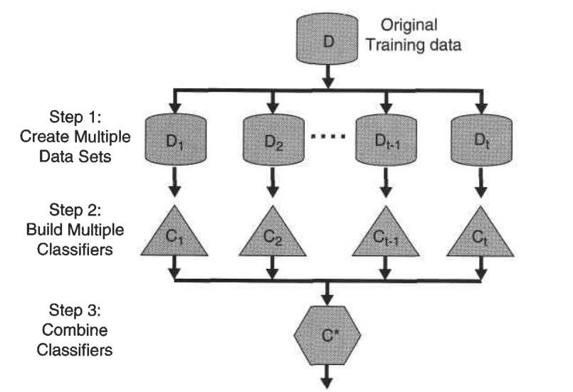
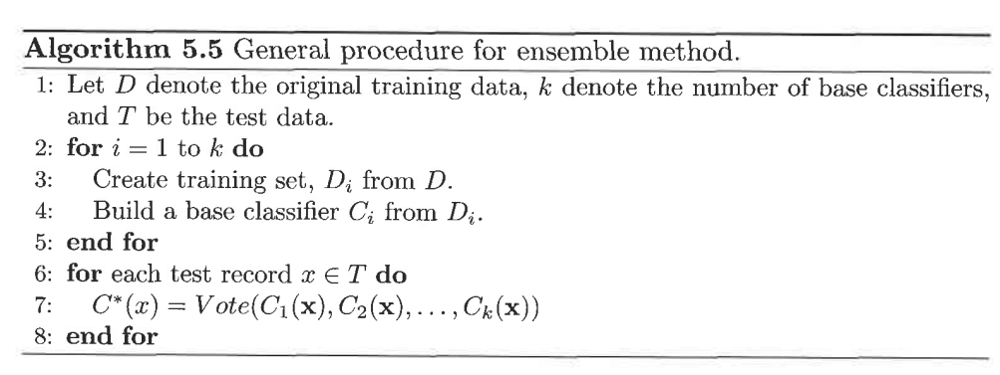

### Bias-Variance Decomposition

<!-- 
La Decomposizione Bias-Varianza è un metodo per analizzare l'errore di predizione di un calassificatore. Si può rapprsentare questo metodo con il seguente esempio:

Prendiamo in cosiderazione il lancio di una palla di cannone verso un bersaglio `y`.

- Bias: misura la distanza media tra la posizione del target e la posizione in cui cade il proiettile (di quanto sbaglia il classificatore ??)

- Varianza: misura la differenza tra la posizoine in cui cade il proiettile `x` e la media `x'` delle posizioni in cui cade mediamente

- Noise: variabilità della posizione del target

Unendo tutte queste componenti otteniamo la seguente formula:

Per il problema della classificazione possiamo utilizzare lo stesso approccio dell'esempio precedente: si può decomporre l'errore in 3 termini diversi (come l'equazione di prima).

Esempi di bias sono: pruning sugli alberi decisionali (dove farlo, quando e su che ramo), numero di vicini in un knn, topologia della rete di un ANN.

I metodi Ensamble cercano di ridurre la varianza di modelli complessi (a basso bias) aggregando le risposte di più classificatori di base.

-->
**Dal tizio di youtube spiegato bene**

L'inabilità di un modello di machine learning nel catturare la vera relazione tra i dati è chiamata **Bias** (min sqrt error, la distanza tra i pallini e la riga rossa).

A sinistra un esempio di bias elevato (c'è molta distanza tra i pallini e la retta), a destra un esempio di bias nullo, la riga rossa riesce perfettametne a dividere ogni pallino.

La **Varianza** è quanta differenza tra acurracy nel dataset di training ed in quello di testing (quanto classifica bene il training e il testing).

A sinistra il training set viene classificato perfettamente, a destra il testing set viene classificato abbastanza male (distanza tra pallini e line) quindi abbiamo una varianza elevata.

Con un bias estremamente piccolo ed un elevata varianza siamo di fronte all'overfitting.

### Bagging

È un metodo di classificazione che manipola i dati di training campionando con ripetizione l'insime di training e ottenendo così `n` sottoset, tutti della stessa dimensione del dataset originale,(fase di bootstrap) che verranno utilizzati per allenare `n` modelli dell'ensamble. I record vengono scelti secondo la distribuzione uniforme e dunque ongi campione di bootstrap conterrà circa `63%` dei dati del set originale. Può capitare che in alcuni campioni di bootstrap compaiano molteplici volte lo stesso record o che alcuni siano del tutto assenti.

Una volta allenati i modelli, per classificare un record mai visto prima viene effettuata una votazione di maggioranza e la classa con più voti risulterà la classe di output (aggregation).

_Romani Artista 🖌️_

Il Bagging migliora l'errore di generalizzazione ridicuendo la varianza dei calssificatori di base, questo perchè le prestazioni del bagging dipendono dal calssificatore di base:

- se il calssificatore di base è instabile, aiuta a ridurre gli errori associati alle fluttuazioni nei dati di training

- se il classificatore di base è stabile (robusto a piccole perturbazioni nell'insieme di addestramento), l'errore dell'ensabmle è principlamente causato da bias nel calssificatore di base. In questo caso il bagging potrebbe non migliorare le performance ma andare addirittura a peggiorarle.

### Boosting

Il Boosting è una procedura iterativa che cambia in maniera adattiva la distribuzione dei campioni di training in maniera tale che vengano favoriti i campioni classificati erroneamente. Ad ogni campione viene assegnato un peso (nella fase iniziale hanno tutti lo stesso `1/N`, con `N` il numero di record) e si effettua un campionamento con ripetizione con cui verrà costruito il primo modello. Successivamente il modello viene testato ed in base agli errori di classificazione commessi, i pesi dei campioni del dataset originale verranno aggioranti e si ripeterà il processo fino ad ottenere il numero di modelli richiesto. I pesi dei record correttamente classificati verranno decrementati metre quelli misclassificati saranno aumentati per far si che nello step successivo verrano scelti.

_Esempio di classificatori generati con 10 Round di Boosting_

Esistono differenti versioni che variano nel come i pesi vengon aggiornati e in come le predizioni fatte dai vari classificatori sono combinate. Una possibile implementazione di questo metodo è l' **Ada Boosting**.

#### AdaBoosting

L'algoritmo di Ada Boosting funziona nel seguente modo:

1. Inizialmente viene assegnato ad ogni record del dataset lo stesso peso: `1/N`.

2. Per ogni feature del dataset viene generato un modello base (e.g. decision stump) e viene calcolato l'errore pesato `ei` di ogni modello. Se `ei` supera `0.5` allora i pesi vengono resettati ai valori di partenza (`1/N`). 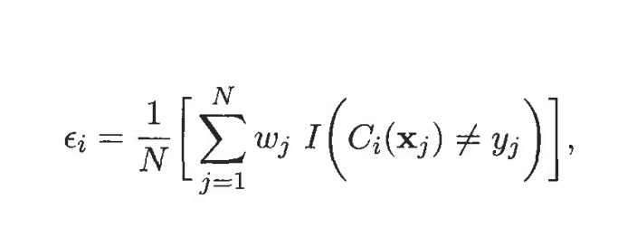.
Da questo errore è possibile ricavarsi il parametro `aj` che verrà utilizzato per aggiornare i pesi nello step successivo (è tipo un indice di performance). 

3. Aggiorna i pesi di ogni record basandosi sulla seguente formula: . Se il record è classificato correttamente il peso viene diminuito, altrimenti viene aumentato. `Zj` è un fattore di normalizzazione che permette di far tornare la somma di tutti i nuovi pesi del dataset a 1 (ricondotto alla probabilità che venga scelto nella nuova istanza di training)(calcola i nuovi pesi e li normalizza).

4. Continua partendo dai nuovi pesi fin quando non si ottine il numero di classificatori voluti.

Dato un test record, il risultato viene scelto basandosi su una media pesata dei risultati di classificazione di tutti i classificatori base. Si tende a dare più peso ai classificatori con accuracy più alta sfavorendo quelli dalle performance peggiori (che solitamente sono quelli generati durante le prime fasi di boosting).

È importante notare che possiamo stimare l'errore di training dell'esnamble ed è dato dalla seguente formula (pone un limite superiore):

Dato che questo algoritmo tende a concentrarsi su esempi di allenamento che vengon classificati in modo errato, la tecnica di boosting può essere piuttosto suscettibile all'overfitting.

### Random Forest

Algoritmo di Random Forset

- 1 boostrap dataset per 1 albero
- faccio tante volte il passaggio precedente ed ottengo un random forset
- ad ogni albero della rando forset vado a fargli vedere i sample outo f bag presi dal bootstrap dataset da cui è generato. COsì vedo l'accuracy del singolo albero. Unisco tutte le accuracy con una proporsione e faccio l'accuracy totale della random forest così posso scegliere meglio il numero di feature da scegliere ad ogni step.

# Artificial Neural Network (ANN)

Le ANN si ispirano al funzionamento del cervello umano, si basano su:

* Neuroni
* Assoni
* Dendridi
* Sinapsi

Le ANN non hanno tutti questi elemnti ma solo i Neuori (Nodi) e gli Assoni (link pesati) che fungono anche da Dendridi e Sinapsi.

Il modello più semplice di ANN è chiamato Percettrone e vedremo che sarà utile per risolvere porblemi di classificazione.

## Percettrone (pompotron :robot: )

Il percettrone consiste in 2 tipo di Nodi:

* Più Nodi di Input: che rappresentano i dati di input
* Un Nodo di Output: che rappresenta l'output del modello

I nodi vengono anche chiamati Neuroni o Unità.

Ogni nodo input è connesso con il nodo outpit tramite un collegamento pesato che emula il collegamento sinaptico. Allenare dunque un percettrone vuol dire aggiustare il valore dei pesi finchè non si adattano alla relazione di input-outpu richiesta. Il risultato del neurone di output è la somma pesata di tutti i neuroni di input più l'aggiunta di un bias (threshold di attivazione)

_Esempio di un percettrone_

Il risultato di un neuroen di output può essere scritto come:

## Modello di Apprendimento del Pompotron

Come detto prima la fase di Training di un Percettrone vuol dire aggiustare i pesi dei collegamenti. La seguente formula indica come effettivamente viene aggiornato il valore dei pesi dei collegamenti:

In modo molto intuitivo, il nuovo peso `w(k+1)` è la combinazione del vecchio peso `w(k)` e un valore proporzionale all'errore di predizione `(y - y^)`. Se la predizione è corretta (il risultato di `(y - y^)` è `0`) allora il peso rimane invariato. Altrimenti viene modificato nel seguente modo:

* Se `y = +1` e `y^ = -1` : l'errore è dunque uguale a `2` e per compensare l'errore bisogna aumentare il peso dei link positivi e diminurie il peso dei link negativi.

* Se `y = -1` e `y^ = +1`: l'errore è dunque uguale a `-2` e per compensare l'errore bisogna diminuire il peso dei link positivi e aumentare il peso dei link negativi.

Lambda è chiamato _Learning Rate_, che è un valore che varia tra 0 e 1 e serve per controllare quanto fini devo essere gli aggiustamenti durante il processo di learning. Se lambda è più vicino a 0, i nuovi pesi variano meno rispetto a quelli precedenti. Se è più vicina ad 1, i nuovi pesi possono variare molto rispetto a quelli vecchi. Alcune volte si può usare il valore lambda in modo adattivo: all'inizio sarà più vicino ad 1 in quanto "deve imparare di più" per poi avvicinarsi sempre più allo 0 pere effettuare delle piccole modifiche per raggiungere la precisione.

Il percettrone sa fare operazioni di classificazione solo se  i dati sono linearmente separabili, altrimenti è necessario aumentare la complessità del percettrone aggiungendo degli Hidden Layer.

I set di dati linearmente separabili possono essere visti come un Hyperpiano che può essere separato da una retta. L'algoritmo di leraning del percettrone converge in problemi linearmente separabili, altrove non converge.
La funzione XOR non è lineramente separabile.

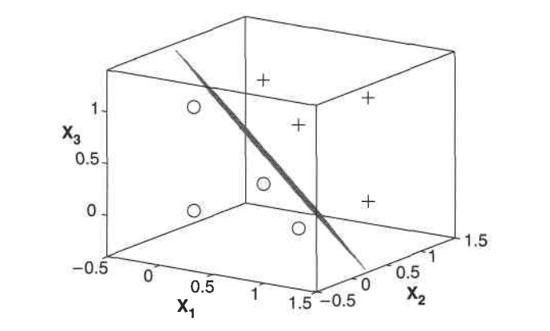

## MultyLayer ANN

Per creare strutture più complesse per classificare dati non linearmente divisibili si possono utilizzare 2 metodi:

* Il primo è quello di inserire vari livelli, detti _Hidden Layer_, tra il livello di input e quello di outpt. La struttura risultante si chiama **MultyLayer Neural Network** può essere distinta in base ai link tra i livelli in 2 categorie:
  * Feed-Forward, dove i noodi in un livello possono solamente connettersi al livello successivo
  * Recurrent, dove i link possono connettere nodi tra lo stesso livello o tra un livello precedente.

* Il secondo è quello di utilizzare funzioni di attivazioni diverse da quella segno, come funzioni lineari, sigmoidi, tangente, ecc..
  Queste funzioni di attivazione permettono ai nodi nascosti e di output di produrre valori di output che hanno valori di input non lineari (come la funzione XOR).
  

_MNN per classificazione di funzione XOR_

### Learning per ANN

<!-- 
Lo scopo dell'algoritmo di learning di un ANN è quello di determinare un seti di pesi che deve minimizzare la somma totale degli errori quadratici:

-->

Il processo di learning si basa sul continuo aggiustamento dei pesi e dei bias, che vengono ricalcolati tramite una funzione costo che varia da implementazione ad implementazione.

Quella più utilizzata è la Gradient Descent che utilizza il gradiente(rappresenta il cammino più ripido verso l'alto) invertito per raggiungere dei minimi locali dell'errore.

Tramite la tecnicla del Back-Propagation si utilizza l'errore nel layer di output per modificare i pesi e i bias degli hidden layer.

### Convolutional Neuarl Network

Questo tipo di rete neurale ha dei layer chiamati Convolutional che hanno a disposizione una matrice detta kernel che verrà sovrapposta ai pixel dell'immagine di input generando una nuova immagine "filtrata" che verrà poi utilizzata dagli hidden layer successivi.
Questo filtraggio serve per trovare pattern e più la rete sarà profonda e più questi pattern saranno complessi (si va da linee e cerchi, fino a volti e animali)

## Problemi di Design delle ANN

Quando si sviluppa una ANN bisogna tenere in cosiderazione questi problemi di design:

* Il numero di nodi di input deve essere determinato, solitamente bisogna creare un nodo di input per ogni variabile, tuttavia, per le variabili categoriche è accettabile codificarle in una variabile k-arry avente `int_sup(log2(k))` nodi di input.

* Il numero di nodi di output deve essere prestabilito: per un problema a 2 calssi basta un solo nodo di output, ma per un problema con k classi ne servono k

* Deve essere scelta una topologia per la rete poichè essa andrà ad influenzare la target function. Per scegliere la giusta topologia si può procedere in 2 modi:
  
  1. Creare una fully connected network e iterarci sopra per costriure una nuova rete ogni volta con un numero minore di nodi (si reitera la procedura di model-buildin e ha una complessità di tempo mooolto alta)
  2. Creare una fully connected network e togliergli nodi per poi ripetere il processo di valutazione della rete.

* Vanno inizializzati i pesi e i bias. E' comunemente accettata una inizializzazione randomica

* Gli esempi di trainign con valori mancanti dovrebbero essere sostituiti o rimossi
