# Machine Learning

## Indice

* [Definizione di un problema di learning](#definizione-di-un-problema-di-learning)
* [Quando usare il Machine Learning](#quando-usare-il-machine-learning)
* [Tipi di Learning](#tipi-di-learning)
  + [Supervised Learning](#supervised-learning)
* [Progettare un sistema di Learning](#progettare-un-sistema-di-learning)
* [Classificazione](#classificazione)
  + [Decision Treeee :evergreen_tree:](#decision-treeee--evergreen-tree-)
  + [Hunt's Algorithm](#hunt-s-algorithm)
* [Problemi di design di alberi ad induzione elettromagnetica :zap:](#problemi-di-design-di-alberi-ad-induzione-elettromagnetica--zap-)
  + [Metodi per effettuare i test](#metodi-per-effettuare-i-test)
    - [Gini](#gini)
    - [Entropy](#entropy)
    - [Pro Vs Cons](#pro-vs-cons)
  + [Caratteristiche degli Alberi](#caratteristiche-degli-alberi)
* [Errori](#errori)
  + [Overfitting e Underfitting](#overfitting-e-underfitting)
* [Model Selection](#model-selection)
  + [Approccio pessimistico](#approccio-pessimistico)
  + [Approccio Ottimistico](#approccio-ottimistico)
  + [PrePruning](#prepruning)
  + [PostPruning](#postpruning)
* [Valutazione delle Performance di un Classificacatore](#valutazione-delle-performance-di-un-classificacatore)
* [Imbalanced Class Problem ⚖️](#imbalanced-class-problem---)
  + [Precision & Recall](#precision---recall)
  + [ROC 🪨](#roc---)
    - [Generazione di una ROC](#generazione-di-una-roc)
  + [Conclusione del problema](#conclusione-del-problema)
* [Nearest Neightor Classification](#nearest-neightor-classification)
  + [Vantaggi](#vantaggi)
  + [Svantaggi](#svantaggi)
* [Bayesian Classification](#bayesian-classification)
  + [Naive Bayesin Calssifier](#naive-bayesin-calssifier)
    - [In Bveve](#in-bveve)
  + [Bayesian Belife Netowrk](#bayesian-belife-netowrk)
    - [In Bveve](#in-bveve-1)
* [Support Vector Machine 🎰](#support-vector-machine---)
  + [Classificazione](#classificazione-1)
  + [Training - Caso Separabile](#training---caso-separabile)
  + [Training - Caso non Separabile](#training---caso-non-separabile)
  + [Training - Caso Non Lineare](#training---caso-non-lineare)
  + [Caratteristiche](#caratteristiche)
* [Ensamble Methods](#ensamble-methods)
  + [Metodi per costriuire Ensamble Classifier](#metodi-per-costriuire-ensamble-classifier)
  + [Bias-Variance Decomposition](#bias-variance-decomposition)
  + [Bagging](#bagging)
  + [Boosting](#boosting)
    - [AdaBoosting](#adaboosting)
  + [Random Forest](#random-forest)
* [Artificial Neural Network (ANN)](#artificial-neural-network--ann-)
  + [Percettrone (pompotron :robot:)](#percettrone--pompotron--robot--)
    - [Modello di Apprendimento del Pompotron](#modello-di-apprendimento-del-pompotron)
  + [Esempi di Funzioni di Attivazione](#esempi-di-funzioni-di-attivazione)
  + [MultyLayer ANN](#multylayer-ann)
  + [Learning per ANN](#learning-per-ann)
  + [Convolutional Neuarl Network](#convolutional-neuarl-network)
  + [Problemi di Design delle ANN](#problemi-di-design-delle-ann)

## Definizione di un problema di learning

Un problema di learning ben posto ha 3 componenti:

- `T`: task
- `P`: performance measure
- `E`: Experience

Date queste 3 componenti, possiamo affermare che un programma del computer apprende se le sue performance per risolvere un task `T`, misurate da `P`, migliorano all'aumentare dell'esperienza `E`.

Una definizione più informale è la seguente: "_L'apprendimento è un qualsiasi processo per cui un sistema migliora le proprie performance dall'esperienza._"

## Quando usare il Machine Learning

L'impiego del Machine Learning può essere utile nei seguenti casi:

- Quando non esiste esperienza umana (navigare su marte)
- Quando gli uomini non possono spiegare la loro esperienza (speach recognition)
- Quando i modelli devono essere personalizzati (medicina personalizzata)
- Quando i modelli si basano su quantità di dati enormi (genomica)

Alcuni campi in cui il Machine Learning ottiene ottimi risultati sono:

- Riconoscimento dei pattern (scrittura a mano, linguaggio parlato)
- Generazione di pattern (generazioni di immagini)
- Riconoscimento delle anomalie (transazioni anomale di un conto bancario)
- Predizione (andamento di mercato)

## Tipi di Learning

* **Supervised Learning (inductive)**: vengono passati i dati per fare il training e i corrispettivi output
* **Unsupervised Learingn**: vengono forniti solamente i dati per il treaning e non gli output
* **Semi-supervised Learning**: vengono forniti i dati per fare il training e parte degli output
* **Renforcement learing**: ogni sequenza di azioni corrisponde ad una ricompensa positiva o negativa (rewareds).

### Supervised Learning

Date le coppie di input e label `(x1,y1), (x2,y2), ...`, guardando il loro andamento è possibile trovare una funzione `f(x)` che permette di predire `y` dato `x`.

In base al tipo di dato che è `y`, possiamo avere 2 tipi di supervised learning differenti:

- `y` è un **numero reale**: regressione 
- `y` è **categorico**: classificazione 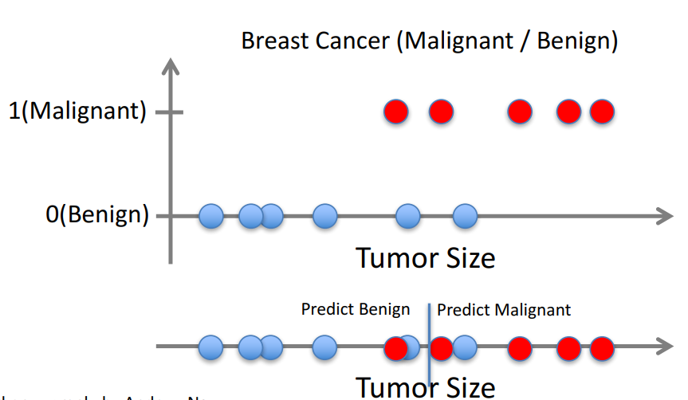

**Unsupervised Learingn**

L'utilizzo principale dell'Unspuervised Learning è l'individuazione di pattern nascosti nei dati di input.
Delle applicazioni concrete possono essere:

* l'organizzazione di cluster di computer
* analisi di social network
* segmentazione del mercato
* astronomical data analysis

**Renforcement learing**

Il Reinforcemetne Learning si basa su un sistema di reward ritardato con il quale viene fornita in output una policy che è una mappatura stato - azione (in un dato stato ti dice quale azione eseguire).
Alcuni esempi possono essere:

* Game Playing
* Robot in a maze
* Bilanciare un palo nella mano


## Progettare un sistema di Learning

Per progettare un sistema di leaning vanno seguiti i seguneti passi:

1. Scegliere il tipo di learning (supervised, unsupervised, ...)
2. Scegliere che cosa si vuole imparare (l'obbiettivo da raggiungere)
3. Scegliere come rappresentare l'obbiettivo
4. Scegliere un algoritmo di learning per dedurre la funzione obbiettivo dall'esperienza


Ogni algoritmo è costituito da 3 componenti:

* Rappresentazinoe
* Ottimizzazione
* Valutazione

Alcune funzioni di rappresentazini:

* Funzioni Numeriche
  * Regressione Lineare
  * Neural Network
* Funzioni simboliche
  * Decison Tree :palm_tree:
* Funzioni Instance-based
  * Nearest neigthbour
* Modelli Probabilistic Gaphical
  * Naive Bayes
  * Hidden Markov Models (HMMS)
  * Probabilistic Context Free Grammars (PCFGs)
  * Markov Networks

Algoritmi di Ricercara/Ottimizzazinoe:

* Gradient decent
  * Perceptron ([Pompotron](https://www.youtube.com/watch?v=0YQmE21aMnw&ab_channel=OrionNebula))
  * BackPropagation
* Dynamic Programming
  * HMM Learning
  * PCFG Learning
* Divide and Conquer
  * Decision tree induction
  * Rule learingn
* Evalutaionary Comutation
  * Genetic Algorhtim (GAs)
  * Genetic Progarmming (GP)
  * Neuro evolution

Alcuni criteri di valutazione:

* Accuracy
* Precision ad Recall
* Squared error
* Likelihood
* Posterior probability
* Cost / Utility
* Margin
* Entropy
* K-L Divergence
* ecc.

## Classificazione

**Definizione Classificazione**: dato un training set, ogni elemento è caratterizzato da una tupla `(x, y)` dove:

* `x` è un inisme di attributi (_input_)
* `y` è il nome della classe (_lable_)

Il nostro obbiettivo è quello di imparare un modello che mappa ogni set di attributi `x` in una data classe `y`.

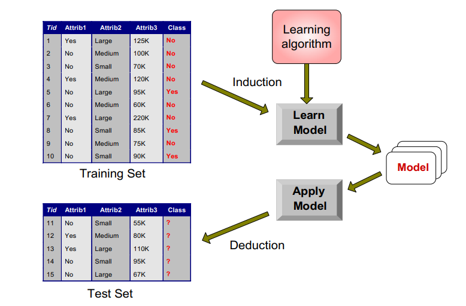

Ci sono vari modi per effettuare la classificacazione che si dividono in 2 principali categorie:

* Base Classification
  * Decision Tree :palm_tree:
  * Rule Based
  * Nearest Neigthbour
  * Neural Netwroks
  * Deep Learning
  * Naive Bayes and Bayesian Belief metods
  * Support Vector Machines
* Ensemble Classification
  * Boosting
  * Bagging
  * Random Forest (:palm_tree: :palm_tree: ? :palm_tree: ?? :palm_tree:)

### Decision Treeee :evergreen_tree:


ALcuni algortmi per la classificacazione basati su decison tree sono:

* Hunt's Algorithm
* CART(s)
* ID3 (volkswagen), C4.5 (Picasso Cytroen)
* SLIQ, SPRINT

### Hunt's Algorithm

**Funzionamento**: sia `Dt` un set di dati di training si ha la segunete procedura:

* se `Dt` contiene record che apparengono alla stessa classe `yt`, allora `t` è un nodo foglia ed appartiene alla classe `yt`
* se `Dt` contiene record che appartengono a più di una classe, allora testa un attributo per dividere i dati in sottoinsiemi più piccoloi. Poi viene applicata ricorsivamente la procedura di prima.


## Problemi di design di alberi ad induzione elettromagnetica :zap:

Due problemi principali sono:

* la determinazione di una metodologia di split che dipende da due fattori principali:
  * specifica di una condizione di test, che dipende dal tipo di attributo
  * unità di misura per valutare la correttezza di una misura di test (quanto bene un attributo rappresenta la classe)
* determinare quando terminare la divisione:
  * fermarla anticipatamente (Eraly termination :robot:)
  * fermarla se tutti i record appartengono alla stessa classe (foglia raggiunta) oppure se hanno tutti gli attributi uguali (porteranno allo stesso risultato)

### Metodi per effettuare i test

Questi metodi variano in base al:

* Tipo di Attributo
  * Binary
  * Nominal
  * Ordinal
  * Continussssss
* Numero di vie per lo split
  * 2 way split
  * multy way split

**Multiway or Biniary Split**:


**Splitting di Attributi Continui**

Possono essere gestiti in 2 modi principali:

* Discretizzazione: permettono di formare categorie ordinali. Possono essere raggruppati in cluster, in insiemi di frequenze equivalenti o intervalli equivalenti. Questa divisione può essere effettuata in maniera **Statica** (solo all'inizio) o **Dinamica** (per ogni nodo)
* Decisione Binaria: esegue dei test binari come `A > v` o `A <= V`

Un possibile approccio è quello greedy che guarda l'indice di purezza della divisione delle classi:


Indici per misurare l'impurità sono :

* GEEEEENEEEEEE Index<br> 
* Entropy<br> 
* Miscalssification error<br> 

**Come scegliere lo split migliore**:

1. Calcolare l'indice di impurità `P` prima dello split
2. Calcolare l'indice di impurità `M` dopo lo split
   * `M` è l'impurità pesata dei figli
3. Scegliere l'attributo che produce il valore `Gain` maggiore: `Gain = P - M` (equivalente a scegliere l'attributo con `M` minore)

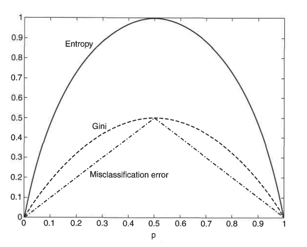

#### Gini

`p(j|t)` è la frequenza relativa della classe j al nodo t

Il valore massimo che può assumere è `1 - 1/nc` quando i record sono distribuiti in maniera equa e quinid si ha un alto livello di impurità

Il minimo è 0.0 che implica che titti i record appartengono ad una sola classe (l'informazione più interessante)

L'indice Gini è usato negli algoritmi CART, SLIQ SPRINT

#### Entropy

L'entropia è come l'indice geany, serve per trovare lo split migliore (quello che ha valore di entropia più vicino allo 0). Questi indici però tendono a tenere in considerazione la purezza degli attributi, senza tenere conto della larghezza dell'albero.

Per aggirare questo problema viene introdotto il Gain Ratio che penalizza le partizioni piccole con molti elementi.


#### Pro Vs Cons

*Pro*:

* Costruzione poco costosa
* Incredibile velocità della classificaizone di record sconosciuti :rocket:
* Di facile interpertazione per alberi di piccole dimenzioni
* Resistente al rumore (IP68)
* Può gestire facilmente attributi ridondanti o irrilevanti

*Contro*:

* lo sapzio delle decisioni piò essere esponenziale e quindi l'approccio greedeeeee non riesce spesso a trovare l'albero migliore
* Non considera le interazioni tra gli attributi
* Il confine decisionale considera solo un attributo alla volta

### Caratteristiche degli Alberi

Se viene utilizzato 1 attributo per test condition le decision baundary corrisponderanno a rette perpendicolari agli assi dei corrisponednti attributi.


_Test condition con un singolo attributo_

Per avere delle decision baoudery più elaborate è necessario creare test condition che considerano attributi multiply.


_Test condition con più attributi: `x + y < 1`_

## Errori

Ci sono 3 tipi di errori:

* **Training**: sono gli errori effettuati durante la fase di training (utilizzando dataset di training)
* **Testing**: sono gli errori effettuati durante la fase di testing (utilizzando il dataset di testing)
* **Generalization**: l'errore intrinseco del modello testato su un insieme di record non precedentemente visti appartenneti alla stessa distribuzione

### Overfitting e Underfitting


**Overfitting**:
Se i dati di training sono sottorappresentativi (non rappresentano bene l'ambiente), all'aumnetare dei nodi aumentano gli errori di testing e diminuiscono gli errori di training. Aumentando la dimenzione dei dati di training riduce questa differenza tra i dati ad un qualsiasi numero di nodi.

__In breve__: se vengono forniti dati che non reappresentano completamente il problema allora l'algoritmo andrà ad imaparare solamente come risolvere quelle situazioni e non riuscirà a gestirne di diverse (esempio: vengono fornite 2 razze di primati per il problema del riconscimento di scimmie, l'algoritmo impareà a conoscere perfettamente quelle 2 razze, ma quando gli verrà presentata una nuova razza non comprednerà che è una scimmia).

Le cause dell'orvefittingo sono:

* Dimenzioni dei dati di Training limitate
* Alto livello di complessità del modello

Decision Trees molto più complessi del dovuto portano all'Overfitting.
Gli errori di Training non forniscono una buona stima degli errori di Testing.

**Underfitting**:
Quando un modello risulta troppo semplice e non è in grado di classificare correttamente i dati.

## Model Selection

Serve per valutare la bontà di un dato modello, e quindi per evitare che incappi in overfitting stimandone il Generalization. Il **Generalization Error** può essere calcolato nei seguenti modi:

* Usando un **Validation Set**
  * E' un set di dati, diverso dal training, che serve per stimare quanto sia affidabile il modello, ma non è sufficiente per il testing (esempio dell'esame di Bartoli). Si creano e allenano più modelli differenti e con il validation set si sceglie quello più preciso.
* Incorporando la **Model Complexity**
  * Un'alta complessità tende a causare un numero maggiori di errori, quindi, dati 2 modelli è sempre meglio preferire quallo con complessità minore. La complessitàsi equivale a: `GenError(Model) = TrainError(Model, TrainData) + a * Complexity(Model)`
* Stimando i Limiti Statistici

### Approccio pessimistico

Questa formula serve per calcolare il Generalization Error e quindi la complessità del Decision Tree


_E' equivalente alla forumla `GenError(Model) = TrainError(Model, TrainData) + a * Complexity(Model)`_

### Approccio Ottimistico

Nel caso in cui non si voglia calcolare il Generalization Error, può essere fatta una stima molto ottimistica dell'errore con il Training Error.

### PrePruning

Per evitare che un modello incappi in overfitting si può applicare la strategia del pruning: ovvero la potatura di alcune foglie per semplificare l'albero.

Il PrePruning avviene prima del completamento del Decision Tree e per decidere quando potare vengono usate dei valori di threshold che, se superati, portano all'eliminazione di un sottoalbero.


### PostPruning

E' simile al prepruning solo che la potatura viene effettuata solo dopo che il Decision Tree viene calcolato completamente, con modalità Bottom-Up.
La classe scelta per sostituire il sottoalbero sarà quella con il numero maggiore di record.
E' più preciso del PrePruning però richiede più calcoli.

## Valutazione delle Performance di un Classificacatore

Ci sono vari modi per valutare le performance di un classificacatore:

* **Medoto Holdout**: consiste nel dividere i dati originali in 2 set: uno di training e uno di testing (la divisione è a discrezione dell'analista). Successivamente il calssificatore viene allenato col set di training e poi viene testata la sua accuratezza con il set di testing. Questo modello presenta svariati problemi: se forniamo troppi dati di testing e pochi di training, il modello potrebbe non operare al massimo delle sue potenzialità, mentre se vengono forniti troppi dati di training e pochi di testing, la stima finale potrebbe non essere affidabile al 100%. Infine, poichè i set di training e di testing sono derivati dallo stesso insieme di dati, potrebbe capitare che uno dei 2 sottoinsieme sia più rappresentativo del dataset originale, mentre l'altro no. Per migliorare la precisione di questo metodo piò essere applicato il Random Subsampling che consiste nel ripetere più volte l'allenamento e il tesing con sottoset differenti per ogni iterazione.
* **Cross-Validation**: un'alternativa al Random Subsempling è il Cross-Validation che consisnte nel dividere il dataset in `k` partizioni di dimenzioni equivalenti e successivamente di utilizzare `k-1 ` partizioni per il training e 1 per il testing. Queste partizioni si scambieranno fin quando tutti gli elementi verranno utilizzati per il testing 1 sola volta. Un metodo speciale è il _leave on out_, che è simile al metodo descritto sopra ma ha `k = N` (dove `N` è la dimenzione del dataset) e consiste nell'usare un solo record alla volta per il tesing. Questa procedura risulta molto precisa ma molto costosa.

## Imbalanced Class Problem ⚖️

In alcuni problemi di classificazione il numero di record delle classi potrebbero essere sbilanciati. Come si può valutare la precisione di un classificatore con queste caratteristiche ??

### Precision & Recall

Per valutare la bontà di un classificatore possiamo utilizzare varie metriche, la più comune è l'Accuracy. Tuttavia, se è più importante che il modello rilevi la "classe rara" (e.g. trasnsazione fraudolenta su dataset di transazioni) l'accuracy non è molto utile perchè il suo valore viene incrementato notevolmente dai record dell'altra classe (quella più comune).

Per visualizzare meglio il problema possiamo utilizzare la **confusion matrix**, una matrice che mette in evidenza come vengono classificati i vari record.


Basandoci sulla confusion matrix possiamo calcolare l'accuracy come: 

Esistono altre metriche importanti per valutare meglio i classificatori:

- **Precision**: serve a mettere in evidenza i _false positive_, più è alta la percentuale meno ce ne sono. (verticale) 
- **Recall**: serve a mettere in evidenza i _false negative_, più è alta la percentuale meno ce ne sono. (orizzontale) 
- **F-measure**: sintetizza in un'unica misura i valori di Precisione e Recall. 

Ne esistono tantissime altre che vanno utilizzate in base al problema specifico che andiamo ad affrontare (generalmente Precision e Recall sono quelle più utili ed efficaci).


**Esempio**:

Nel seguente esepmio possiamo vedere come l'Accuracy è alta ma i valori di Precision e Recall sono estremamente bassi, indice di un classificatore dalle scarse performance (tabella 1).


### ROC 🪨


Un metodo grafico per confrontare vari modelli è quello di utilizzare le curve **ROC** (Reciver Operating Characteristics). Esse rappresentano la relazione tra True Positive Rate (**TPR**, asse y) e False Positive Rate (**FPR**, asse x) mostrando i compromessi tra TPR e FPR.

Nelle ROC ci sono dei punti che hanno un'interpretazione ben conosciuta:

- (0, 0): un modello che predice tutte le istanze come negative
- (1, 1): un modello che predice tutte le istanze come positive
- (1, 0): modello ideale con assenza di False Positive (le azzecca tutte)

La retta che congiunge i punti (0, 0) e (1, 1) rappresenta il Random Guessing. Se un grafico si avvicina a questa il modello fa molto schifo.

Se un grafico si trova più a sinistra dell'altro (più verso (1, 0)) allora è migliore localmente. Non possiamo però affermare che uno è meglio dell'altro in generale.

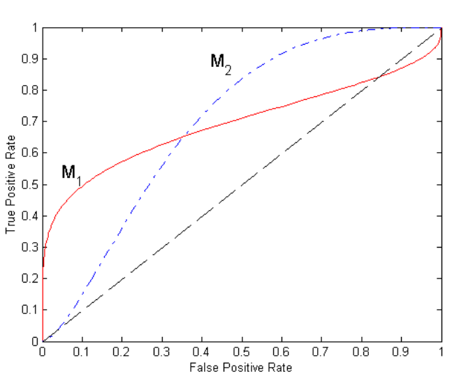

Nella figura precedente possiamo vedere che il modello M1 risulta migliore con un FPR inveriore di ~0.36, invece M2 è migliore con un FPR maggiore. Non possiamo però affermare che uno sia meglio dell'altro globalmente.

Un buon indice per valutare quando un modello è migliore di un altro in generale è calcolare l'area sotto la curva ROC, se questa è maggiore di un altro modello possiamo affermare che questo è migliore dell'altro globalmente. Se l'area di una ROC è 0.5 rappresenta un modello equivalente al Random Guessing. Un modello ideale ha l'area uguale ad 1.

#### Generazione di una ROC

Le curve ROC possono essere rappresentate solo se il modello produce output continui che verranno utilizzati per fare il ranking delle predizioni. Questi output continui potrebbero essere le Posterior Probabilities generate da un Naive Bayesian Classifier o valori numerici prodotti da un ANN.

Assumendo che gli output del modello siano continui per tracciare la curva ROC bisogna:

1. Ordinare tutti i record di test in ordine crescente in base al loro valore di output
2. Selezionare il record con rank più basso e assegnare questo e tutti gli altri record sopra di lui come Positive Class (equivale a classificare tutto come Positive Class, TPR = FPR = 1)
3. Selezionare il record successivo, classificare il record selezionato e tutti quelli superiori come Positive e quelli sotto di esso come Negative. Aggiornare il TPR e FPR come segue:
   - se il record precedente è Positive, decrementa il TP Count e lasciare inalterato i FP Count
   - se il record precedente è Negative, decrementa i FP Count e lascia inalterati i TP Count
4. Ripeti lo step 3 fin quando non raggiungi il record con il rank più alto.
5. Stampa TPR e FPR


### Conclusione del problema

Per risolvere il problema delle classi sbilanciate bisogna:

- Undersample della classe più popolosa
- Oversample della classe più rara.

## Nearest Neightor Classification

Esistono dei tipi di algoritmi di learning che non costruiscono un modello a priori per classificare i dati ma che li classificano solamente nel momento del bisogno, essi sono detti leazy learners. Un esempio è il Rote Classifier che si ricorda tutti i suoi esempi di training e una volta passati dei dati di testing li calssifica solo se corrispondono esattamente a dati già visti nella fase di training. Questo implica una scarsa flessibilità nella classificazione. E' stato quindi ideato un approccio più generale chiamato Nearest Neighto Classifire.

Esso si basa sullo stesso concetto della Rote Classifire ma non guarda l'equivalenza ma la similarità tra il dato di testing e quelli di training, ovvero cerca i vicini più vicini al record di testing.

I dati con `n` attributi vengono rappresenati su uno spazio n-dimenzionale e la precisione della classificazione dipende da una variabile distanza `k`. Ci sono altre varianti di questo algoritmo che alternao il modo di determinare i vicini più vicini basandosi non solo sulla distanza ma anche sulla _classe di maggioranza_, oppure sulla _classe di maggioranza con distanze pesate_ dove non conta solamente la classe che compare più volte ma anche la sua distanza dal record di testing (più lontano sarà e minore sarà l'importanza).
È importante notare che un numero `k` troppo alto di vicini potrebbe includere anche classi errate ed un numero troppo piccolo risulta essere molto sensibile al rumore.


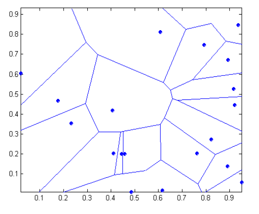


_Diagramma di Voronoi per 1-nearest Neightbotr e Distanza Euclidea_

### Vantaggi

* Non hanno bisogno di manterere un modello astratto derivato dai dati
* Non richiedono model building
* Poichè possono genereare decision boundaries arbitrariamente dispongono di una maggiore flessibilità rispetto agli eager learner

### Svantaggi

- Richiedono più computazione degli eager learner nella fase di testing
- Poichè fanno classificazioni basate su informazioni locali sono molto suscettibili al rumore
- Possono generare errori di classificazione se non avvengono step di preprocessing (aggiustamento delle scale dei dati)

## Bayesian Classification

Un classificatore bayesiano basa il suo processo di learning su un importatne teorema statistico: Il teorema di Bayes.


Questo teorema fornisce un modo per revisionare delle predizioni o teorie esistenti, aggiornandone le probabilità in seguito alla scoperta di informazioni aggiuntive.
Il teorema afferma che: la _probabilità a posteriori_ `P(Y|X)` è data dal prodotto della _probabilità condizionale di classe_ `P(X|Y)` per la _probabilità a priori_ `P(Y)` fratto le _nuove inofrmazioni_ `P(X)`

**N.B.** quando si confrontano varie probabilità per differenti valori di Y, il denominatore può essere ignorato.

Tale teorema può essere applicato da un algoritmo di ML in due modi in base a come viene implementato il calcolo della _probabilità condizionale di classe_:

* Naive
* Belif Network

Per la classificazione si va a vedere il valore più alto tra le varie probabilità a posteriori `P(Y|X)` e la classe con probabilità maggiore sarà la vincente.

### Naive Bayesin Calssifier

Il metodo Naive calcola il valore di `P(X|Y)` nel seguente modo:


Va però fatta una distinzione in base ai tipi di attributo che si prendono in considerazione:

* **Categorici**: si calcola il rapporto tra il numero di volte che l'attributo compare all'interno dei record che contengono la classe in questione fratto il numero di volte che compare la classe Y in questione
* **Continui**: per trattare questi dati si può procedere in 2 modi diversi:

  * **Discretizzando**: si dividono i dati in intervalli più piccoli trasformando quindi l'attributo continuo in un attributo categorico e si procede come visto sopra. Bisogna fare attenzione a come vengono scelti gli intervalli: troppo grandi sono poco precisi e troppo piccoli causano overfitting
  * **Utilizzano le distrubuzioni di Probabilità**: si cerca una distribuzione di probabilità più adatta alle variabili continue e si stimano i parametri della distribuzione usando i dati di training. Generalmente la ditribuzione Gaussaina è la più utilizzate e quindi ne deriva la seguente formula: 

Se una probabilità condizionale è `0` allora verrà azzerata tutta l'espressione. Per questo motivo sono state implementate delle variazioni che permettono di evitare il problema:


#### In Bveve

* Sono resistenti a punti di rumore isolati che vengono cancellati durante i calcoli
* Sono resistenti ad attributi irrilevanti
* Le performance vengono peggiorate da attributi correlati perchè non esiste più l'assunzione dell'indipendenza condizionale (per risolvere questo problema si usa il BBN spiegato dopo)

### Bayesian Belife Netowrk

Se sono presenti degli attributi correlati questo algoritmo offre performance migliori. Esso fornisce una rappresentazione grafica delle relazioni probabilistiche tra un insieme di variabili random tramite un DAG (Grafo Orentato Aciclico).
A seconda del numero di nodi padri viene fatta una distinzione:

* Se non ha genitroi allora contiene la probabilità a priori `P(X)`
* Se ha 1 solo genitore, contiene la probabilità condizionale `P(X|Y)`
* Se ha più genitori, contine la probabilità condizione `P(X|Y1, Y2, ..., Yn)`
  

Queste probabilià vengono poi inserite in una tabala relativa ad ogni nodo. Durante la classificazione vengono presi questi valori per caloclare la classe di appartenenza.

#### In Bveve

* Permette la visualizzazione grafica tramite un DAG
* La prima costruzione richiede molto tempo e risorse, ma una volta costruito è di facile gestione
* Gestiscono facilmente i dati incompleti (attributi mancanti)
* Resistente al Model Overfitting

## Support Vector Machine 🎰

Le Support Vector Machine sono una tecnica di classificazione basata sullo _statistical learning_ che di recente ha visto un incremento di interesse nell'ambito della ricerca. Si presta bene alla classificazione e riconoscimento di testi.

La sua applicabilità ricade principalmente in casi in cui i dati sono lineramente separabili, ma sono state studiate strategie per poterle applicare anche negli altri casi.

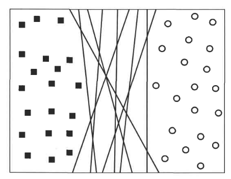

Il principio di funzionamento di questi classificatori si basa nel suddividere l'insieme dei dati di training con un iperpiano affinchè i dati a destra e a sinistra dell'iperpiano facciano parte di classi distinte (linearmente separabili).

_In breve_: individuazione dell'iperpiano che separa i dati.

Tuttavia, per un dato set di dati è possibilie trovare infiiti iperpiani che separano i dati, dunque è importante trovare l'iperpiano che dia i risultati migliori. Per farlo è necessario introdurre il concetto di **margine**: il margine può essere identificato come la distanza tra le retette parallele all'iperpiano passanti per i vettori di supporto (i punti del dataset) di classi diverse più vicini.

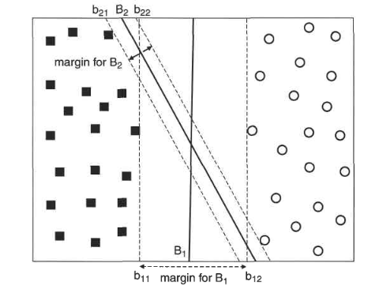

Per ottimizzare il modello, l'algoritmo dovrà cercare i vettori di supporto più vicini andando a massimizzare il loro margine, poichè un margine ampio genera un minore errore di classificazione (su record non visti precedentemente) e riduce l'overfitting.

### Classificazione

Essendo l'iperpiano una retta, il decision baundary del modello può essere rappresentato con la seguente formula:


dunque, per poter classificare i dati situati al disopra e la disotto del decision baudary, per un dato input (`z`) dovremmo risolvere la seguente disequazione:


### Training - Caso Separabile

Come per tutti i classificatori lineari, l'obiettivo di training sarà quello di stimare i paramentri `w` e `b` per determinare un decision baoundary, questi parametri andranno scelti in modo tale da rispettare le seguenti condizioni:


Tuttavia per le SVM è necessario un requisito aggiuntivo, ovvero quello di massimizzare il margine relativo al decision baoudnary. Il margine può essere ricavato tramite la seguente formula:


Dobbiamo quindi massimizzare questa distanza, ma per motivi matematici e di semplificazione dei calcoli possiamo riscriverla nel seguente modo e minimizzarla (risulterà più semplice minimizzare che massimizzare):


Riassumendo, il processo di training di una Linear SVM con dati separabili, può essere formalizzato con il seguente problema di ottimizzazione vincolato:


Per risolvere effettivamente questo problema, sarà necessario riscrivere la funzione obbiettivo come Lagrangiana affinchè essa tenga conto dei vincoli imposti alle sue soluzioni.


_Ulteriori spiegazioni sono delegate al Dott. Cristian Cosci :scroll:._

### Training - Caso non Separabile


Come si vede dall'immagine, `B2` è l'unico margine privo di errori, tuttavia essendo piccolo è molto suscettibile all'overfitting. Per questo motivo può essere una buona opzione scegliere il margine `B1` che, anche se presenta dei piccoli errori, è molto probabile che dia performance che siano migliori in generale. Questo approccio è detto **Soft Margin** e consiste nel trovare un compromesso tra larghezza del margine e numero di errori commessi nella fase di training. Questo permette anche di risolvere semplici problemi non linearmente separabili.

La funzione per la massimizzazione del margine rimane invariata rispetto a quella dell'approccio per dati separabili, tuttavia bisognerà cambiare le restrizioni che verranno invalidate dal nostro nuovo approccio. Sarà necessario avere una piccola soglia di tolleranza agli errori durante la fase di training, questo viene raggiunto introducendo le *Slack Variables* che forniscono una stima dell'errore per il decision baundary su un dato esempio di training.


Tuttavia, applicando questa definizione direttamente all'algoritmo di training, non viene imposto alcun vincolo sul numero di errori che possono essere commessi e di conseguenza, l'algoritmo troverebbe un margine molto ampio ma pieno di errori in fase di training. Per evitare il problema è necessario penalizzare decision baundary con un valore delle slack variable alto.


I parametri `C`e `k` rappresentano quanto l'errore penalizzi il modello. Per esempio:

- con valori di C **grandi**, il peso delle violazioni aumenta e di conseguenza si avrà un margine piccolo che porterà ad overfitting
- con valori di C **piccoli**, si avrà un margine ampio con molti errori ed un elevato bias

### Training - Caso Non Lineare

Gli approcci definiti fino ad ora non sono applicabili agli spazi di training non linearmetne separabili, dunque è necessario trovare un nuovo approccio che consiste nel trasformare lo spazio di partenza `x` in uno spazio linerametne separabile `fi(x)`.


Come possiamo vedere da questo esempio, il decision boundary che originariamente era circolare viene linearizzato applicando la trasformazione non lineare `fi(x)`.


Il nuovo learning task potrà essere formalizzato come il seguente problema di ottimizzazione:


L'unica differenza con il caso linearmente separabile è che il vincolo viene calcolato non più sul set degli attributi base `x` ma, sulla loro trasformazione `fi(x)`, che è un vettore con tante componenti quante sono le dimensioni dello spazio trasformato.

Sviluppando la Lagrangiana, il calcolo si ridurrà a un *dot product* (prodotto scalare o similarità) tra una coppia di vettori dello spazio trasformato (`fi(xi) * fi(xj)` ). Tuttavia questo calcolo risulta essere tremendamente costoso e per causa sua possiamo incappare nella **Maledizione della Dimensionalità**: aumentando il numero di dimensioni (featurs) il quantitativo di dati necessario per generalizzare con precisione aumenta esponenzialmente (servono tantissimi dati di training per permettere al modello di apprendere tutte le possibili combinazioni di feature possibili)!

Questo problema può essere aggirato tramite il **Kernel Trick**.

Il kernel trick è un metodo che permette di calcolare la similarità tra 2 vettori partendo dal set di attributi originale, che può essere espresso come segue:


La sua applicabilità richiede che sia vera la seguente affermazione: deve esistere una trasformazione corrispondente tale che la kernel function calcolata per una coppia di vettori è equivalente al dot product dei vettori nello spazio trasformato. Tale proprietà viene espressa dal teorema di Mercer.


In sostanza, applicando la funzione kernel si evita di calcolare le `fi`, riducendo il costo computazionale dell'algoritmo.

### Caratteristiche

Le caratteristiche generali delle SVM sono le seguenti:

- Il learning problem può essere formulato come un problema di ottimizzazione convesso per i quali sono disponibili algoritmi molto efficienti che garantiscono il ritrovamento di un minimo globale (che fornisce le performance migliori)
- Performa il Capacity Control, massimizzando il margine del Decision Baundary
- Può essere applicato a variabili categoriche introducendo Dummy Variables per ogni categoria degli attributi
- Sono applicabili a problemi multiclasse

## Ensamble Methods

Gli ensamble methods sono delle tecniche di classificazione che basano il loro principio di funzionamento sul combinare vari classificatori per ottenere un risultato più preciso.
È stato osservato che i classificatori di base non devono essere correlati tra di loro perchè in quel caso l'errore di generalizzazione totale non verrà migliorato dal metodo ensable (meglio classificatori indipendenti).

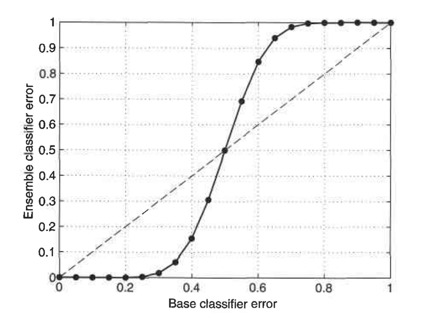

Dall'immagine possiamo notare come i metodi ensamble vanno a migliorare il generalization error totale solo fino a quando il generlazization error dei modelli di base è migliore del random guessing (<.5). La linea tratteggiata mostra le performance di classificatori base correlati tra di loro, mentre la riga contininua mostra le performance di classificatori base indipendenti.

### Metodi per costriuire Ensamble Classifier

1. **Manipolando i dati di training (training set)**: vengono creati più set di training basandosi su una qualche distribuzione di campionamento. Dopodichè viene creato un classificatore utilizzando degli algoritmi particolari come _Bagging_ e _Boosting_.
2. **Manipolando le input features**: da ogni dataset viene scelto un sottoinsime di input features che verranno poi utilizzate per allenare i vari classificatori dell'ensamble.
3. **Manipolando le lable di classe**: questo metodo si usa quando ci sono un grande numero di classi, il dataset di training viene trasformato in un problema di classificazione binario partizionando le lable in due sottoinsiemi disgiunti A0 e A1 che verranno utilizzate successivamente per allenare un classificatore. Ripetendo questo step più volte (relabling) si otterrà un ensamble di classificatori base. Quando poi verrà passato un dato di test `x` viene fatta la somma delle volte che viene classificato nella classe A0 o nella classe A1 e poi viene scelta la calsse di maggioranza.
4. **Manipolando l'algoritmo di leanring**: l'algoritmo di learning scelto viene applicato più volte per ottenere più modelli di base che poi verranno utilizzati per creare l'ensamble. Un esempio di modelli che si prestano meglio a questo processo sono i decision tree e le ann, perchè variando i parametri (pesi, bias, topologia del modello, ecc.) con cui sono costruiti creano calssificatori abbastanza diversi.

I primi 3 approcci sono metodi generici, mentre l'ultimo è dipendente dal tipo di classifciatore utilizzato.

Gli ensablme methods funzionano meglio con classificatori instabili, ovvero modelli molto sensibili a piccole perturbazioni nel dataset di training.


### Bias-Variance Decomposition

<!-- 
La Decomposizione Bias-Varianza è un metodo per analizzare l'errore di predizione di un calassificatore. Si può rapprsentare questo metodo con il seguente esempio:

Prendiamo in cosiderazione il lancio di una palla di cannone verso un bersaglio `y`.


- Bias: misura la distanza media tra la posizione del target e la posizione in cui cade il proiettile (di quanto sbaglia il classificatore ??)

- Varianza: misura la differenza tra la posizoine in cui cade il proiettile `x` e la media `x'` delle posizioni in cui cade mediamente

- Noise: variabilità della posizione del target

Unendo tutte queste componenti otteniamo la seguente formula:


Per il problema della classificazione possiamo utilizzare lo stesso approccio dell'esempio precedente: si può decomporre l'errore in 3 termini diversi (come l'equazione di prima).

Esempi di bias sono: pruning sugli alberi decisionali (dove farlo, quando e su che ramo), numero di vicini in un knn, topologia della rete di un ANN.

I metodi Ensamble cercano di ridurre la varianza di modelli complessi (a basso bias) aggregando le risposte di più classificatori di base.


-->

**Dal tizio di youtube spiegato bene**

L'inabilità di un modello di machine learning nel catturare la vera relazione tra i dati è chiamata **Bias** (min sqrt error, la distanza tra i pallini e la riga rossa).

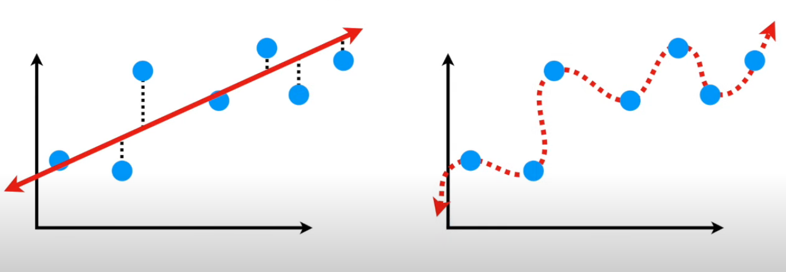

A sinistra un esempio di bias elevato (c'è molta distanza tra i pallini e la retta), a destra un esempio di bias nullo, la riga rossa riesce perfettametne a dividere ogni pallino.

La **Varianza** è quanta differenza c'è tra acurracy nel dataset di training ed in quello di testing (quanto classifica bene il training e il testing).


A sinistra il training set viene classificato perfettamente, a destra il testing set viene classificato abbastanza male (distanza tra pallini e linea) quindi abbiamo una varianza elevata.

Con un bias estremamente piccolo ed un elevata varianza siamo di fronte all'overfitting.

### Bagging

È un metodo di classificazione che manipola i dati di training campionando con ripetizione l'insime di training e ottenendo così `n` sottoset, tutti della stessa dimensione del dataset originale,(fase di bootstrap) che verranno utilizzati per allenare `n` modelli dell'ensamble. I record vengono scelti secondo la distribuzione uniforme e dunque ongi campione di bootstrap conterrà circa `63%` dei dati del set originale. Può capitare che in alcuni campioni di bootstrap compaiano molteplici volte lo stesso record o che alcuni siano del tutto assenti.

Una volta allenati i modelli, per classificare un record mai visto prima viene effettuata una votazione di maggioranza e la classa con più voti risulterà la classe di output (aggregation).

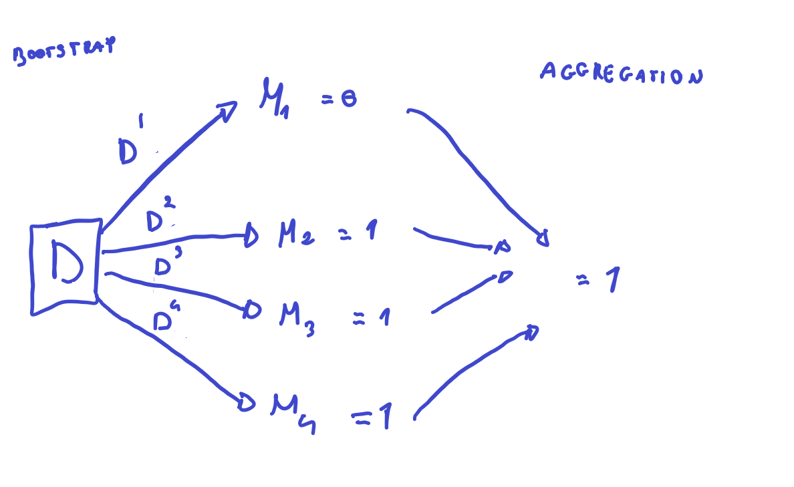
_Romani Artista 🖌️_

Il Bagging migliora l'errore di generalizzazione ridicuendo la varianza dei calssificatori di base, questo perchè le prestazioni del bagging dipendono dal calssificatore di base:

- se il calssificatore di base è instabile, aiuta a ridurre gli errori associati alle fluttuazioni nei dati di training
- se il classificatore di base è stabile (robusto a piccole perturbazioni nell'insieme di addestramento), l'errore dell'ensabmle è principlamente causato da bias nel calssificatore di base. In questo caso il bagging potrebbe non migliorare le performance ma andare addirittura a peggiorarle.

### Boosting

Il Boosting è una procedura iterativa che cambia in maniera adattiva la distribuzione dei campioni di training in maniera tale che vengano favoriti i campioni classificati erroneamente. Ad ogni campione viene assegnato un peso (nella fase iniziale hanno tutti lo stesso `1/N`, con `N` il numero di record) e si effettua un campionamento con ripetizione con cui verrà costruito il primo modello. Successivamente il modello viene testato ed in base agli errori di classificazione commessi, i pesi dei campioni del dataset originale verranno aggioranti e si ripeterà il processo fino ad ottenere il numero di modelli richiesto. I pesi dei record correttamente classificati verranno decrementati metre quelli misclassificati saranno aumentati per far si che nello step successivo verrano scelti.


_Esempio di classificatori generati con 10 Round di Boosting_

Esistono differenti versioni che variano nel come i pesi vengono aggiornati e in come le predizioni fatte dai vari classificatori sono combinate. Una possibile implementazione di questo metodo è l' **Ada Boosting**.

#### AdaBoosting

L'algoritmo di Ada Boosting funziona nel seguente modo:

1. Inizialmente viene assegnato ad ogni record del dataset lo stesso peso: `1/N`.
2. Per ogni feature del dataset viene generato un modello base (e.g. decision stump) e viene calcolato l'errore pesato `ei` di ogni modello. Se `ei` supera `0.5` allora i pesi vengono resettati ai valori di partenza (`1/N`). .
   Da questo errore è possibile ricavarsi il parametro `aj` che verrà utilizzato per aggiornare i pesi nello step successivo (è tipo un indice di performance). 
3. Aggiorna i pesi di ogni record basandosi sulla seguente formula: . Se il record è classificato correttamente il peso viene diminuito, altrimenti viene aumentato. `Zj` è un fattore di normalizzazione che permette di far tornare la somma di tutti i nuovi pesi del dataset a 1 (ricondotto alla probabilità che venga scelto nella nuova istanza di training)(calcola i nuovi pesi e li normalizza).
4. Continua partendo dai nuovi pesi fin quando non si ottine il numero di classificatori voluti.

Dato un test record, il risultato viene scelto basandosi su una media pesata dei risultati di classificazione di tutti i classificatori base. Si tende a dare più peso ai classificatori con accuracy più alta sfavorendo quelli dalle performance peggiori (che solitamente sono quelli generati durante le prime fasi di boosting).

È importante notare che possiamo stimare l'errore di training dell'esnamble ed è dato dalla seguente formula (pone un limite superiore):


Dato che questo algoritmo tende a concentrarsi su esempi di allenamento che vengono classificati in modo errato, la tecnica di boosting può essere piuttosto suscettibile all'overfitting.

### Random Forest

L'algoritmo Random Forest combina le decisioni di più alberi decisionali (ensamble). Ogni albero viene generato basandosi su valori di un vettore scelto a caso tramite una distribuzione di probabilità fissa (a differenza di quella dell'AdaBoosting che variava nel tempo).

Usare il Bagging con alberi decisionali è un particolare tipo di Random Forest che serve per aggiungere casualità durante la costruzione del modello per evitare alberi troppo correlati tra di loro.

Si può stimare un limite superiore del generalizzation error (a patto che il numero di alberi della random forest sia abbastanza elevato):


dove `p` rappresenta la correlazione media tra gli aberi e `s` misura la forza dell'albero di decision (le performance medie dei classificatori). Più gli alberi diventano correlati (`p` grande) o la forza `s` diminuisce, maggiore sarà il limite dell'errore (il generalization error aumenta). La correlazione può essere migliorata tramite la randomizzazione.


Un vettore casuale può essere incorporato nella crescita dell'albero in più modi (come creare il vettore random):

1. **Forest-RI** (random input selection):  vengono selezionate randomicamente `F` features (colonne) tra cui scegliere per effettuare lo split di ogni nodo dell'albero. L'albero viene costruito interamente senza effettuare pruning per ridurre il baias. La forza `s` e la correlazione `p` dipendono da `F`:

   - F **piccolo** genera una minore correlazione (la migliora) tra gli alberi ma una minore forza (la peggiora)
   - F **grande**: genera una meggiore correlazione (la peggiora) ma una maggiore forza (la migliora)

     Un modo (trade-off) per scegiere la dimensione di `F` è data dalla seguente formula:
        dove `d` è il numero di features.

   Dato che non vengono prese in cosiderazione tutte le features per effettuare gli split, il tempo di runtime è considerevolmente ridotto.
2. **Forest-RC**: se il numero di feature originale `d` è troppo piccolo è difficile scegliere un set di random features indipendente, quindi un modo per risolvere questo problema è quello di creare nuove combinazioni lineari di feature. Per fare questo, ad ogni split dell'albero vengono prese `L` features di input e vengono combinate tra loro seguendo una distribuzione uniforme ([-1, 1]) e di queste nuove feature viene scelta qualla che genera lo split migliroe. Anche questa migliora le performance di tempo.
3. **Metodo 3**:  viene selezionata randomicamente una tra le migliori feature di split (le guarda tutte quelle a disposizione). Se le feature a disposizione sono poche può generare alberi correlati tra di loro (meglio utilizzare uno degli altri due metodi). Questo metodo non ha il vantaggio di andare a migliorare il tempo di esecuzione perchè è costretto a controllare tutte le features ad ogni split.

Le Random Forest sono più robuste al rumore e veloci rispetto all'AdaBoost, sono anche più resistenti all'overfitting dato che hanno alberi più profondi e quindi hanno un bias ridotto.

## Artificial Neural Network (ANN)

Le ANN si ispirano al funzionamento del cervello umano, si basano su:

* Neuroni
* Assoni
* Dendridi
* Sinapsi

Le ANN non hanno tutti questi elemnti ma solo i Neuori (Nodi) e gli Assoni (link pesati) che fungono anche da Dendridi e Sinapsi.

Il modello più semplice di ANN è chiamato Percettrone e vedremo che sarà utile per risolvere porblemi di classificazione.

### Percettrone (pompotron :robot:)

Il percettrone consiste in 2 tipi di Nodi:

* Più Nodi di Input: che rappresentano i dati di input
* Un Nodo di Output: che rappresenta l'output del modello

I nodi vengono anche chiamati Neuroni o Unità.

Ogni nodo input è connesso con il nodo outpit tramite un collegamento pesato che emula il collegamento sinaptico. Allenare dunque un percettrone vuol dire aggiustare il valore dei pesi finchè non si adattano alla relazione di input-outpu richiesta. Il risultato del neurone di output è la somma pesata di tutti i neuroni di input più l'aggiunta di un bias (threshold di attivazione)

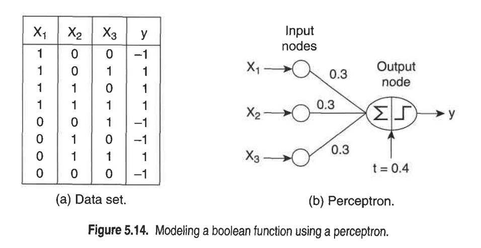

_Esempio di un percettrone_

Il risultato di un neurone di output può essere scritto come:


#### Modello di Apprendimento del Pompotron

Come detto prima la fase di Training di un Percettrone vuol dire aggiustare i pesi dei collegamenti. La seguente formula indica come effettivamente viene aggiornato il valore dei pesi dei collegamenti:


In modo molto intuitivo, il nuovo peso `w(k+1)` è la combinazione del vecchio peso `w(k)` e un valore proporzionale all'errore di predizione `(y - y^)`. Se la predizione è corretta (il risultato di `(y - y^)` è `0`) allora il peso rimane invariato. Altrimenti viene modificato nel seguente modo:

* Se `y = +1` e `y^ = -1` : l'errore è dunque uguale a `2` e per compensare l'errore bisogna aumentare il peso dei link positivi e diminurie il peso dei link negativi.
* Se `y = -1` e `y^ = +1`: l'errore è dunque uguale a `-2` e per compensare l'errore bisogna diminuire il peso dei link positivi e aumentare il peso dei link negativi.

Lambda è chiamato _Learning Rate_, che è un valore che varia tra 0 e 1 e serve per controllare quanto fini devo essere gli aggiustamenti durante il processo di learning. Se lambda è più vicino a 0, i nuovi pesi variano meno rispetto a quelli precedenti. Se è più vicina ad 1, i nuovi pesi possono variare molto rispetto a quelli vecchi. Alcune volte si può usare il valore lambda in modo adattivo: all'inizio sarà più vicino ad 1 in quanto "deve imparare di più" per poi avvicinarsi sempre più allo 0 per effettuare delle piccole modifiche per raggiungere la precisione.

Il percettrone sa fare operazioni di classificazione solo se  i dati sono linearmente separabili, altrimenti è necessario aumentare la complessità del percettrone aggiungendo degli Hidden Layer.

I set di dati linearmente separabili possono essere visti come un Hyperpiano che può essere separato da una retta. L'algoritmo di leraning del percettrone converge in problemi linearmente separabili, altrove non converge.
La funzione XOR non è lineramente separabile.


### Esempi di Funzioni di Attivazione

Alcuni esempi di funzioni di attivazione usati negli ANN sono:

- *identity*: viene utilizzata quando il target è un valore reale (quando si lavora con numeri reali)
- *sign*: si usa su problemi binari
- *sigmoid*: si usa quando si lavora con le probabilità perchè i valori di ritorno sono compresi tra 0 e 1
- *tanh*: simile alla sigmoid ma varia tra -1 e 1. Preferibile alla sigmoid quando gli output richiedono valori sia positivi che negativi
- *ReLU*
- *Hard Tanh*


### MultyLayer ANN

Per creare strutture più complesse per classificare dati non linearmente divisibili si possono utilizzare 2 metodi:

* Il primo è quello di inserire vari livelli, detti _Hidden Layer_, tra il livello di input e quello di outpt. La struttura risultante si chiama **MultyLayer Neural Network** può essere distinta in base ai link tra i livelli in 2 categorie:
  * *Feed-Forward*, dove i nodi in un livello possono solamente connettersi al livello successivo
  * *Recurrent*, dove i link possono connettere nodi tra lo stesso livello o tra un livello precedente.


* Il secondo è quello di utilizzare funzioni di attivazioni diverse da quella segno, come funzioni lineari, sigmoidi, tangente, ecc..
  Queste funzioni di attivazione permettono ai nodi nascosti e di output di produrre valori di output che hanno valori di input non lineari (come la funzione XOR).
  


_MNN per classificazione di funzione XOR_

### Learning per ANN

L'obiettivo dell'allenamnto di una rete neurale è quello di determinare un set di pesi che minimizzano la somma degli errori quadratici medi:

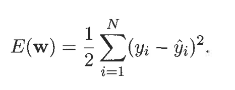

La somma degli errori dipende da `w` perchè la classe predetta `y^` è una funzione che dipende dai pesi assegnati ai nodi nascosti e quelli di output.

Poichè spesso l'output di un ANN è *non lineare* non si riesce a determinare una soluzione per `w` che sia garantita essere globalmente ottimale. Tuttavia sono stati sviluppati dei metodi per aggirare questo problema come il **Gradient Descent**.

La formula per determinare i pesi secondo il gradient descent è la seguente:


dove `lambda` rappresenta il larning rate. Il secondo termine è l'errore che va minimizzato (modifichi i pesi `w` per diminuirlo), tuttavia succede spesso che rimane intrappolato in un minimo locale (perchè la error function non è lineare) senza riuscire a trovare il minimo globale. Questo metodo viene utilizzato per trovare i pesi dei nodi di output e di quelli hidden, ma per questultimi risulta molto difficile calcolare il secondo termine dato che non si conoscono i valori di output. Questo problema si risolve tramite la **Back Propagation**: in questo metodo, ogni iterazione dell'algoritmo viene suddivisa in 2 fasi:

1. *Forward*: i pesi ottenuti dalle precedenti iterazioni sono utilizzate per calcolare i valori di outpu di ogni neurone
2. *Backward*: la formula per l'aggiornamento dei pesi viene applicata al contrario , questo ci permette di usare l'errore dei nodi al layer `k+1` per stimare l'errore dei nodi al layer `k`.

### Convolutional Neuarl Network

Poichè in alcuni problemi la posizione del pattern da individuare può variare all'interno dell'input è importante che i modelli siano *Shift Invariant*, ovvero che nel cambiamento della posizione dell'oggetto che si vuole analizzare non deve andare a degradare la capacità di classificarlo del classificatore. Di solito nei modelli standard questo non è possibile a meno che non si creino più modelli che prendono in input varie parti del campione da analizzare, i cui output verranno combinati per individuare il pattern. Tutti i modelli che formano questa mega rete devono essere identici.


Il modo migliore per risolvere questo problema è di utilizzare le **Convolutional Neaural Network**  (CNN) che introducono 2 nuovi tipi di layer che permettono di estrarre le feature latenti presenti nell'immagine (*Convolutional* e *DownSampling*):

- Il layer **Convolutivo**: è composto da un insieme di kernel/filter (matrici) che vengono fatte scorrere sull'immagine per generare una nuova matrice di output che mette in risalto determinate fearure presenti nell'input. Questo layer è definito dai pesi (valori del filtro), bias e la dimensione dei passi che farà mentre si sposta lungo l'input (stride). Spesso la dimensione della matrice di output è minore di quella di input e dunque ci sarà una perdita di informazione, per questo a volte può essere importante aggiungere del padding (tanti 0) attorno all'input originale per mantenere gli output identici.  
- Il **Pooling** Layer: serve a sintetizzare l'applicazione del kernerl in un numero che viene inserito in una matrice che ha dimensione pari alla dimensione dello stride. 

Combinando questi due layer con una fully connected network si può ottenere una rete convolutiva.


### Problemi di Design delle ANN

Quando si sviluppa una ANN bisogna tenere in cosiderazione questi problemi di design:

* Il numero di nodi di input deve essere determinato, solitamente bisogna creare un nodo di input per ogni variabile, tuttavia, per le variabili categoriche è accettabile codificarle in una variabile k-arry avente `int_sup(log2(k))` nodi di input.
* Il numero di nodi di output deve essere prestabilito: per un problema a 2 calssi basta un solo nodo di output, ma per un problema con k classi ne servono k
* Deve essere scelta una topologia per la rete poichè essa andrà ad influenzare la target function. Per scegliere la giusta topologia si può procedere in 2 modi:

  1. Creare una fully connected network e iterarci sopra per costriure una nuova rete ogni volta con un numero minore di nodi (si reitera la procedura di model-buildin e ha una complessità di tempo mooolto alta)
  2. Creare una fully connected network e togliergli nodi per poi ripetere il processo di valutazione della rete.
* Vanno inizializzati i pesi e i bias. E' comunemente accettata una inizializzazione randomica
* Gli esempi di trainign con valori mancanti dovrebbero essere sostituiti o rimossi

## Cluster Analysis

La Claster Analysis divide i dati in vari gruppi (clusters) che sono sia Significativi che Utili. In base allo scopo finale della cluster analysis possiamo identificare 2 differenti tipi di analisi:

- **Understanding**: serve per dividere i dati in vari gruppi in base alle caratteristiche che accomunano i dati stessi (serve per identificare le possibili classi per la classificazione in modo automatico).
- **Utility**: approccio che fonrinisce un'astrazione dei dati individuali all'interno del cluster, generando un **cluster prototype**. Questi cluster prototypes possono essere utilizzati come basi per tecniche di data analysis e data pocessing.

È difficile definire come ogni cluster debba essere costituito poichè per certo dataset esistono molteplici modi  corretti di suddividere i dati in vari cluster (guarda foto sotto). L'unico modo per capire qual è la corretta suddivisione in cluster e' analizzando i dati.

_N.B il clustering può sembrare simile alla classificaizone ma risulta essere privo di fase di training supervisionato._


### Tipi di clustering

Il clustering è la collezione di un insieme di cluster. Possono essere suddivisi in base ad alcune caratteristiche che possono presentare:

#### Hierachicla vs Partitional

- _hierachical_: suddivide i dati in cluster nestati che possono essere rappresentati con un albero in cui la radice rappresenta la totalità del dataset e, più si va in profondità, più aumenterà il numero di clustere e diminuirà il numero di record.
- *partitional*: i dati vengono suddivisi in maniera "standard", dunque non sono ammessi sottocluster all'interno di ogni cluster. Ogni layer dell'albero di un Hierachical Clustering può essere visto come un Partitonal Clustering diverso.

#### Exclusive vs Overlappign vs Fuzzy

- *exclusive*: ogni data object può appartenere ad un solo cluster
- _overlapping_: ogni data object può appartenere a più cluster simultaneamente. Questo può essere utili per dati che possono essere identificati in più classi (uno studente universitario può anche essere un dipendente dell'università)
- _fuzzy_: ogni data object appartiene a tutti i cluster con un peso di appartenzenza (mebership) che varia tra `0` e `1` dove `0` rappresenta la NON appartenenza e `1` la totale appartenenza. Sostanzialmente crea una distribuzioen di probabilità dell'appartenenza dei dati alle varie classi (è esclusivo, ogni dato può appartenere solo ad un cluster).

#### Complete vs Partial

- *complete*: assegna tutti i data object del data ad un cluster senza lasciarne nessuno fuori
- *partial*: esclude dai cluster alcuni elementi che non mostrano appartenenza a nessun cluster (possono essere punti di *rumore* o *outliers*)

### Tipi di Cluster

- *Well Separated*: sono dati ben divisi tra di loro (appiano naturalmente separati e non globulari). Ogni dato del cluster è più vicini ai punti del cluster a cui appartiene che ai punti di altri cluster.
- Prototype Based: si basa sul concetto di Prototype (la generalizzazione del Cluster), ogni data object è più vicino al Prtototype del cluster di appartenenza che del Prototype di altri cluster. Per attributi continui, il prototype del cluster è il **Centroid** (la media); per attributi categorici è il **Medoid** (il punto più rappresentativo). Viene anche chiamato **Center Based**.
- Graph Based: i dati sono raggruppati in base alle connessioni che hanno sul grafo che li rappresenta. Un cluster è un insieme di punti connessi tra di loro che non sono connessi con altri elementi. È suscettibile al rumore in quanto un punto può creare ponti tra cluster differenti ed unirli.
- Density Based: guarda la densità dei punti. Un cluster è un insieme denso di punti corcondato un un insime con scarsa densità. È più resistente al rumore del Graph Based.
- Shared Property: un cluster è formato da data object che hanno alcune caratteristiche in comune


### Clustering Algorithms

#### K-means

Questo algoritmo è una tecnica di **Partitional Clustering** basata su **Prototype-Based Cluster**. Funziona cercando di trovare, dato un numero di Centroidi definito dall'utente `K`, i punti che sono più vicini ad ogni centroide e che andranno quindi ad identificare un cluster (simile al knn).

Ci sono due variazioni di questo algoritmo, a seconda del tipo di dato con cui lavoriamo:

- K-means per dati continui
- K-medoid per dati categorici

##### Algoritmo

1. Si selezionano `K` punti come Centroidi (punti a caso nel dataset)
2. Si assegna ogni punto del dataset al suo centroide più vicino e si ricalcolano i centroidi dei nuovi cluster così generati
3. Si continua fin quando i centroidi non cambiano più

Spesso la condizione `3.` genera dei punti che oscillano tra cluster differenti impedendo che l'agoritmo converga in una soluzione, dunque è possibile rilassare questa condizione rimpiazzandola con la seguente:

```
si continua fino a quando solo l'1% dei punti cambia cluster
```

A seconda del tipo di spazio di dati con cui si lavora possono essere utilizzate varie misure di prossimità per calcolare la distanza punti-centroidi. Alcuni esempi sono:

- **Euclidea (L2)** o **Manhattan (L1)** per gli spazi Euclidei
- **Cosine Similarity** o la **Jaccard Measure** per i documenti

Per scegliere i Centroidi migliori ottenuti con varie esecuzioni del K-means è necessario scegliere un objective function adeguata. Per farlo è necessario calcolare la qualità del Clustering utilizzando la Somma dell'Errore Quadratico (SSE). Guardando questo indice, dati due cluster ottentuti con K-means, quello che avrà SSE minore sarà il migliore. Per calcolare l'SSE con la distanza Euclidea si usa la seguente foruma:


La formula che segue è come vengono aggiornati i centroidi all'i-esima iterazione


Con vari calcoli, utilizzando la distanza euclide, si può dimostrare che il centroide migliore è la media.


Inizializzare in modo Random i Centroidi può degradare la qualità dei Cluster creati dato che non è garantita la convergenza ad un minimo globale. Un approccio naive per risolvere questo problema potrebbe essere quello eseguire più volte il K-means scegliendo ogni volta Centroidi di partenza diversi ed infine scegliendo il Clustering con SSE minore. Risulta essere molto costoso e non garantisce il ritrovamento di una soluzione. Un altro metodo è di creare dei Cluster di tipo Hierarchical campionando dei punti dal dataset ed utilizzarli per calcolare i Centroidi che verranno poi utilizzati come centroidi iniziali. Questo approccio è utilizzabile solo se i campioni sono piccoli (Hierarchical Clustering è costoso) e `K` deve essere piccolo rispetto alla dimensione dei campioni.

##### Costo

- Spazio: `O((m+K)n)` dove `m` è il numero di data point, `n` è il numero di attributi
- Tempo: `O(I*K*m*n)` dove `I` è il numero di iterazioni richieste per la convergenza

`I` può essere limitata superiormente dato che tendenzialmente i cambiamenti più significativi avvengono nelle prime iterazioni. L'algoritmo risulta efficiente e semplice a patto che `K` sia significativamente minore di `m`.

##### Bisecting K-Means

Il funzionamento è il seguente:

1. Considera tutti i dati come un unico mega cluster
2. Applica 2-means (k-means con 2 centroidi) per ottenere 2 sotto cluster
3. Scegli il sottocluster da suddividere basandosi su criteri come numero di elementi (splitti quello più grosso) o SSE (splitti quello con SSE maggiore)
4. Ripetere step 2. e 3. fino al numero desiderato di cluster


##### Applicabilità

K-means si applica a cluster globulari, ben separabili e con dimensioni e denstià simili. Per K abbastanza grando può essere applicato a cluster naturali ed è in grado di trovare sottocluster puri. È molto susciettebile agli outliears e la loro detection e rimozione può essere molto utile.


#### Agglomerative Hierarchical

Queste tecniche sono utilizzate per generare cluster di tipo Hierarchical e ne esistono 2 diversi tipi:

- **Agglomerative**: all'inizio ogni punto è un cluster e procedendo con l'algoritmo, punti vicini vengono fusi insieme fino ad ottenere un unico mega cluster. È necessario definire il concetto di 'prossimità'.
- **Divisive**: inizia con un cluster contenente tutti i punti che mano a mano viene diviso, fino ad ottenere cluster singleton. Serve una tecnica per decidere chi e come splittare.

È possibile rappresentare Clustering di questo tipo con un diagramma simile ad un albero chiamato _Dendrogramma_.


##### Basic alghoritm

1. Calcola la prozimity matrix (se necessario)
2. Unisci i due cluster più vicini
3. Aggiorna la proximity matrix
4. Ripeti i punti 2. e 3. fin quando non rimane un solo cluster

Ciò che caratterizza questi algoritmi di Clustering è il metodo con cui viene definita la _prossimità_. I due approcci principali sono:

- Graph Based: Si basa su un'astrazione del cluster che viene visto come un Grafo. Per questa tecnicha si hanno varie implementazioni:

  - **MIN**: calcola la prossimità in funzione della distanza tra i punti più VICINI di cluster differenti (aka single link). Questa tecnica è buona per gestire cluster dalla forma non-ellittica, ma molto sensibile a rumore e punti di outlier.
  - **MAX**: calcola la prossimità in funzione della distanza tra i punti più LONTANI di cluster differenti (aka complete link). Risulta più resistente al rumore ed agli outliers ma può spezzare cluster grandi favorendo forme globulari.
  - **GROUP AVARAGE**: calcola la media delle distanze tra tutti i punti di due cluster differenti. Questo approccio è un compromesso tra il MIN e il MAX. È meno suscettibile al rumore ma predilige forme globulari.
- Prototype Based: basa il calcolo della prossimità sui centroidi (che rappresentano il cluster).

  - **Centroid Method**: basa il calcolo della prossimità sulla distanza tra i centroidi di differenti cluster (forse deve essere minima). Questo metodo presenta un problema che non è presente in nessun altro metodo Hierarchical: l'**inversione**, in cui due cluster che vengono fusi possono essere più simili di un paio di cluster fusi in precedenza.
  - **Ward's Method**: aggiunge al calcolo, oltre all'uso dei centroidi, il concetto di SSE che deve risultare minia quando vengono fusi due cluster. Questa tecnica è meno susciettibile al rumore, ma favoreggia cluster di forma globulare. Utilizza la stessa objective function del K-means ('è l'equivalente gerarchico del K-means').

##### Complessità

La complessità in spazio è: `O(m^2)`.

La complessità in tempo è: `O(m^3)`.

Va notato che questa può essere ridotta se si utilizzano liste ordinate o heape per teneree traccia dei dati. Questo riduce la complessità in tempo a: `O(m^2 logm)`.

Questi costi molto elevati rendono la scalabilità di questi tipi di clustering molto difficile.

##### Forza e Punti Deboli

1. **Mancanza di una objective function globale**: le tecniche appena viste decidono localmente il processo di ottimizzazione. Questo è uno svantaggio perchè non ci sarà un processo di ottimizzazione globale, però semplifica anche la risoluzioen del problema. Per via della sua complessità in spazio e in tempo molti dataset non sono risolvibili. Questo problema dell'ottimizzaizone dervia dal fatto che una votla effettuata l'operazioen di merge essa non potrà essere annullata. Una possibile soluzione a questo problema di non reversibilità è quello di provare a spostare i rami dell'albero generato per provare a migliorare la global objective function; un altro metodo ancora è quello di utilizzare un algoritmo come K-means per generare molti piccoli cluster che verranno utilizzati come punto di partenza dall'algoritmo di hierarchcal clustering.
2. Sono suciettibili al rumore
3. Presentando difficolta nel gestire cluster di diverse dimensioni e di forma non globlulare
4. Dividono cluster grandi in cluster più piccoli

#### DBScan

DBScan è un algoritmo di Clustering che si basa sul concetto di densità: per uno specifico punto è la quantià di punti vicini ad esso compresi in un dato raggio (definito dall'utente) _EPS_ (questo include anche il punto stesso !). Questo metodo è abbastanza semplice da implementare ma la scelta del raggio risulta critica, per un EPS abbastanza grande possiamo avere, come densità di un punto, `m` (il numero dei punti nel nostro dataset) e per un raggio sufficientemente piccolo riusciamo a trovare come densità 1. L'algoritmo DBScan cerca di trovare un modo per la scelta di un EPS adeguato.

In base al punto in cui si trovano, i data point di un Clustering di tipo Center-Based possono essere classificati nel seguente modo:

- **Core Point**: punti interni ad un density based cluster sono quei punti che ricadono all'interno di un ragio specifico (_EPS_) e superano una certa condizione _MinPts_. Sia EPS che MinPTS sono scelti dall'utente.
- **Border Point**: sono quei puti che non sono Core Point, ma che ricadono all'interno di un vicinato di un Core Point. Un Border Point può appartenere a diversi vicinati di Core Point diversi
- **Noice Point**: sono quei punti che non sono nè Core Point nè Border Point.


Nella figura sottostante possiamo vedere che, dato un EPS e MinPts <= 7, il Punto `A` risulta essere un Core Point (ha 7 punti nel suo vicinato e quindi supera la condizione di MinPts); il punto `B` non soddisfa la condizione MinPts ma ricade all'interno di un vicinato (quello del punto A) quindi è un Border Point; `C` non è nè un core poitn nè un border point quindi è un Noise Point.


##### Algoritmo

1. Etichetta tutti i punti come **Core**, **Border** o **Noise**
2. Elimina i Noise Point
3. Raggruppa tutti i Core Point che sono all'interno di un raggio _EPS_ gli uni degli altri
4. Crea un cluster con ogni gruppo di Core Point creato allo step 3.
5. Assegna ogni border point ad uno dei suoi core point associati 

Il problema principale di questo algoritmo è quello di selezionare un valore appropriato per _EPS_ e _MinPts_. L'approccio base per trovarli è quello di guardare come varia la distanza tra i punti ed i loro k-esimi vicini più vicini (k-dist). Per punti che appartentgono ad un cluster, k-dist sarà piccola (alta densità); mentre per Noice Point sarà grande (bassa densità). È dunque possibile stimare i parametri calcolando la k-dist per ogni punto del dataset, ordinarli in ordine crescente e vedere il punto in cui c'è la variazione più netta (il momento di transizione tra elementi appartenenti ad un cluster e rumore). Questo valore verrà utilizzato com EPS ed il valore k (utilizzato nella k-dist) verrà assegnato a MinPts. Il varole EPS dipende dalla scleta di `k`, ma generalmente non cambia poi così tanto al variare di k. Se `k` viene scelto troppo piccolo, allora anche alcuni Noice Point verranno inseriti nei cluster; invece con `k` troppo grande, cluster di piccole dimensioni verranno etichettati come rumore. DBScan originale utilizza `k = 4` dato che funziona generalmente bene per la maggior parte dei dataset di 2 dimensioni.

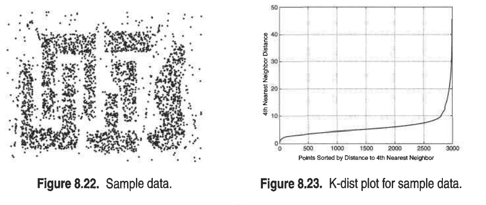

##### Complessità in Spazio e Tempo

La complessità in spazio di questo algoritmo è `O(m)` in quanto deve salvare in memoria solo poche informazioni (l'etichetta di ogni punto: Core, Noise, Border ed il cluster lable).

La complessità in tempo è, nel caso peggiore `O(m^2)`, ma tramite l'utilizzo di strutture dati come i kd-tree (solo nel caso di dataset con spazio a bassa dimensione), riesce a scendere fino a `O(m logm)`.

##### Vantaggi e Svantaggi

- Può trovare cluster con forme che non potrebero essere trovate da nessun altro algoritmo
- Se la densità dei punti del dataset sono estremamente variabili non è garatntito il rirovamteno di una soluzioen corretta
- È resistente al rumore
- Poco applicabile quando si lavora con alte dimensionalità
- Se non è possibile calcolare i vicini più vicini utilizzando struttre dati particolari, l'algoritmo può risultare costoso (generalmente succede in dataset ad alte dimensioni)


### Cluster Evaluation

A volte può essere utile valutare i risultati forniti da un algoritmo di Clustering allo stesso modo in cui viene valutato un modello di classificazione. Spesso non è necessario e non è facile da applicare dato che ci sono vari algoritmi con funzonamenti diversi e per ogni caso servirebbere metodi e mteriche diverse. Gli algoritmi di clustering trovano sempre cluster anche se effettivamente non esistono cluster naturali nei dati, quindi risulta utile controllare se quiei cluster sono sensati (in dati con alte dimensioni non è facile individuare visivamente questa problematica).


Gli indici di valutazione utilizzati per valutare vari aspetti dei cluster sono suddivise nelle seguenti categorie:

- **Unsupervised**: misura varia aspetti della struttura del cluster senza basarsi su dati esterni (un esempio è SSE), spesso sono chiamati **Internal Indices**. Ne esistono 2 sotto categorie:
  - _Cluster Cohesion_: determina quanto gli oggetti del cluster sono correlati tra di loro
  - _Cluster Separation_: determina quanto, cluster differenti, sono separati o ben distinti l'uno dall'altro
- **Supervised**: misura quanto le strutture generate da un algoritmo di clustering, corrispondono ad una qualche struttura esterna (un esempio è l'Entropia). Spesso queste misure sono chiamate **External Indices**.
- **Relative**: misura che serve per confrontare diversi clustering o cluster tra di loro. Può essere sia Supervised che Unsupervised. Un esempio può essere l'SSE per l'unsupervised e l'entropy per la supervised.

#### Unsupervised Choesion and Separation

La validità di un cluster per un insieme di K cluster, in generale può essere espressa come la somma pesata della validità dei singoli cluster:


La funzione `validity` può essere sia Coesione, Separazione o una combinazione delle due. I pesi `w` dipendono da caratteristiche del cluster: potrebbero essere tutti 1, la radice quadrata della coesione, la dimenisone del cluster, ecc.
Se, per la validity function si sceglie la coesione, valori grandi sono meglio; se viene scelta la separaziome, valori più piccoli sono meglio.

##### Graph Based

Per i graph based cluster, la Coesione e la Separazione vengono espressi nel seguente modo:

- Coesion: è la somma dei pesi dei cammini nel proximity graph che connette punti nello stesso cluster 
- Separation: è la somma dei pesi dei cammini dai punti di un cluster ai punti di un altro cluster. 


##### Prototype Based

Per i cluster prototype based la coesione e la separazione  si esprimono nel seguente modo:

- Coesion: è definita come la somma delle prossimità tra il prototipo di un cluster (centroide/medoide) ed i suoi punti. 
- Separation: è data dalla misura della prossimità di prototipi di due cluster differenti. 


##### Overoll

Questi due indici possono essere misurati in vari modi in base a come viene calcolato il peso. Questi sono alcuni esempi:


##### Relazione tra Coesione e Separation

La Coesione e la Seprarazione sono, in alcuni casi, fortemetne correlate tra di loro, infatti è possibile dimostrare (noi non lo faremo) che la somma tra SSE Totale e SSB Totale è costante, ergo massimizzare l'SSB (separazione) equivale a minimizzare l'SSE (Coesione).